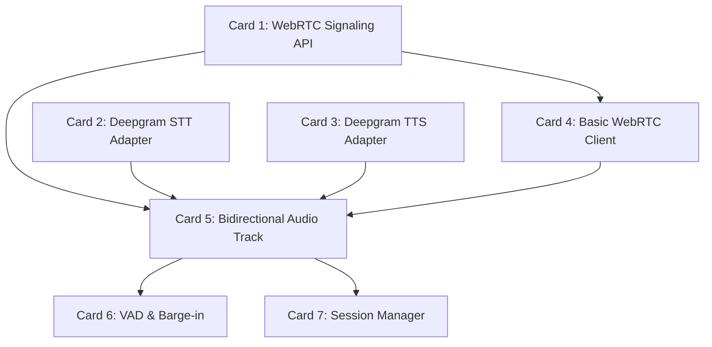

# Component 02: Voice & Realtime Layer - Feature Board

This board breaks down the WebRTC and STT/TTS component into manageable "cards". Some cards can be built independently, while others depend on previous cards being completed.

## Dependency Graph (Connections)

---

## 🟢 Independent Feature Cards (Can be built immediately)

### [x] Card 1: WebRTC Signaling API
*   **Goal**: Create the entry point for the browser to connect to the backend.
*   **Tasks**:
    *   Create `src/gateway/server.py`.
    *   Add a FastAPI `POST /webrtc/offer` endpoint.
    *   Initialize `aiortc.RTCPeerConnection` and process the SDP offer/answer.
*   **Dependencies**: None.

### [x] Card 2: Deepgram STT Adapter
*   **Goal**: Connect to Deepgram's Live streaming API to convert audio to text.
*   **Tasks**:
    *   Create `src/adapters/stt_deepgram.py`.
    *   Establish an async WebSocket connection to Deepgram.
    *   Implement async generators to emit `transcript.partial` and `transcript.final` events.
*   **Dependencies**: None *(Requires Deepgram API Key)*.

### [x] Card 3: Deepgram TTS Adapter
*   **Goal**: Connect to Deepgram's Aura API to convert agent text into speech.
*   **Tasks**:
    *   Create `src/adapters/tts_deepgram.py`.
    *   Take text chunks and return streaming audio bytes.
*   **Dependencies**: None *(Requires Deepgram API Key)*.

---

## 🟡 Dependent Feature Cards (Require other cards first)

### [x] Card 4: Basic WebRTC Client
*   **Goal**: Build the browser UI to test the signaling API.
*   **Tasks**:
    *   Update `client/index.html` and `client/app.js`.
    *   Request microphone permissions via `getUserMedia`.
    *   Create a browser `RTCPeerConnection` and send the SDP offer to the backend.
*   **Dependencies**: Requires **Card 1** to be finished.

### [x] Card 5: Bidirectional Audio Track
*   **Goal**: The core audio router. Connects the browser's audio to the AI stack.
*   **Tasks**:
    *   Create `src/gateway/audio_track.py`.
    *   Inherit from `aiortc.MediaStreamTrack`.
    *   **Inbound**: Route WebRTC mic audio to Card 2 (STT).
    *   **Outbound**: Route Card 3 (TTS) audio to the WebRTC speaker.
*   **Dependencies**: Requires **Card 1**, **Card 2**, and **Card 3**.

### [x] Card 6: VAD & Barge-in
*   **Goal**: Decide when the user is actually speaking (vs silence/noise) and drive interruption of agent playback—WebRTC carries audio but does not define this behavior.
*   **Tasks**:
    *   [x] VAD: gateway RMS (`src/gateway/vad.py`) + STT partial backup + client data-channel hints (`client/app.js`).
    *   [x] Emit `speech_started`, `speech_ended`, `barge_in.detected`, `speak.cancel` via `CallSession._emit_event` (+ WebRTC `events` data channel to browser).
    *   [x] `speak.cancel` → `DeepgramTTSAdapter.cancel()` + `AgentAudioTrack.clear_playback()`; ignore STT finals during/after agent speech.
    *   [x] Metrics: `BargeInMetrics` in `src/gateway/barge_in.py` (logged on session end); tune via `VAD_RMS_THRESHOLD` env.
*   **Dependencies**: Requires **Card 5** (bidirectional audio path in place).

### [x] Card 7: Session Manager
*   **Goal**: Manage the lifecycle of a call and emit system events.
*   **Tasks**:
    *   Create `src/gateway/session.py`.
    *   Bind the PeerConnection, Audio Track, and Orchestrator events together; **extend** with **Card 6** (`barge_in.detected`, `speak.cancel`) when VAD is implemented.
    *   Handle client disconnects and garbage collection/cleanup.
*   **Dependencies**: Requires **Card 5**. Integrate **Card 6** for full barge-in behavior.
