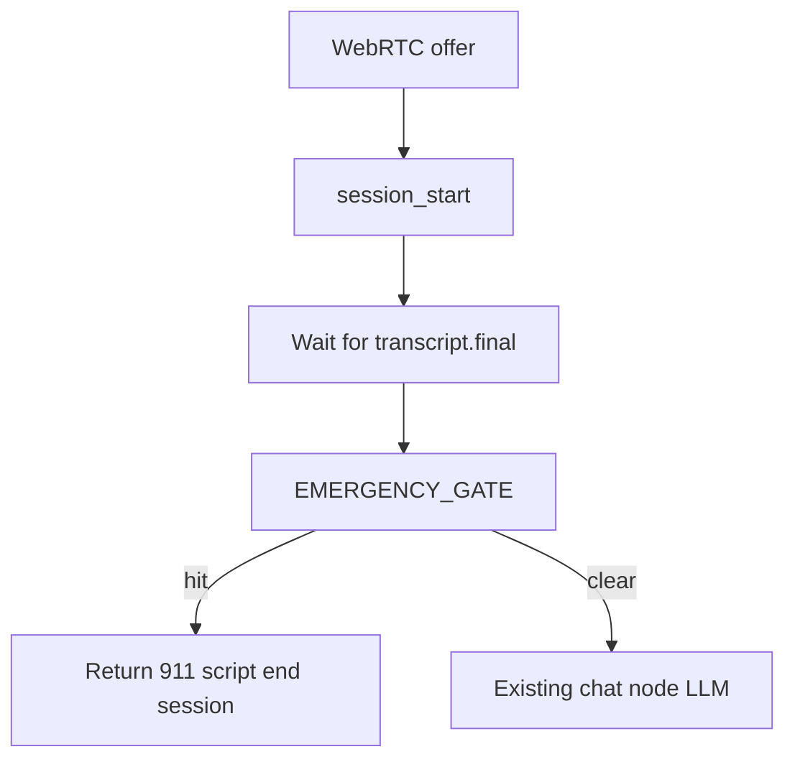

# Component 03 — Sub-plan 01: `session_start` & `EMERGENCY_GATE`

**Parent:** [03_orchestrator_cards.md](./03_orchestrator_cards.md) (Component 03 orchestration)  
**Overview:** First implementation slice — session bootstrap + keyword emergency gate (no LLM, no tools).

---

## Context

Per [orchestrator-discuss.md](../../under%20development%20and%20discussion/Discussion/orchestrator-discuss.md) and [list of orchestrator components to plan.md](../../under%20development%20and%20discussion/Discussion/list%20of%20orchestrator%20components%20to%20plan.md):

- Both nodes: **no LLM**, **no LLM tools**
- `session_start`: once per call, bootstrap orchestrator state
- `EMERGENCY_GATE`: on **every** `transcript.final`, **before** LangGraph/LLM

Current code only has message list + stub `chat` in [`src/orchestrator/__init__.py`](../../src/orchestrator/__init__.py); emergency is a line in `SYSTEM_PROMPT` only. WebRTC creates `CallSession` in [`src/gateway/server.py`](../../src/gateway/server.py) but does not call an orchestrator lifecycle hook.

**Scope for this plan:** These two nodes only. `PLAY_911_SCRIPT` is a thin return path (fixed PRD string) bundled with gate hit—not a separate build phase. Full LangGraph multi-node graph and `trigger_emergency` LLM backup are **out of scope** (later sub-plans).



---

## Implementation todos

- [ ] Add `OrchestratorSessionState` + `session_lifecycle` (`start_session`, `get_session`, `end_session`)
- [ ] Call `start_session` from `server.py` on WebRTC offer; refactor `__init__.py` to use state dict
- [ ] Add `emergency_phrases.py` + `emergency_gate.py` with PRD categories and matcher
- [ ] Run `check_emergency` at top of `handle_transcript`; return 911 script on hit; skip LLM
- [ ] Add `tests/test_emergency_gate.py` and `tests/test_session_lifecycle.py`
- [ ] Add `scripts/chat_terminal.py` for manual testing
- [ ] Update checklist + `progress.md` when complete

---

## Node 1: `session_start`

### Spec (plan fields)

| Field | Value |
|-------|--------|
| **LLM** | No |
| **Node prompt** | N/A |
| **Tools** | None |
| **Enter** | WebRTC `POST /webrtc/offer` succeeds → `CallSession` created |
| **Exit** | State initialized; `active_node = PATIENT_IDENTIFY`; ready for first user text |

### Responsibilities

1. Create orchestrator record keyed by `session_id` (same id as [`CallSession.session_id`](../../src/gateway/session.py))
2. Initialize state fields (v1 in-memory dict; design allows Redis later per [03-component-orchestration.md](../../system%20design/03-component-orchestration.md) §8):
   - `active_node`: `"PATIENT_IDENTIFY"`
   - `patient_id`, `proposed_slot`, `appointment_id`: `null`
   - `session_ended`: `false`
   - `emergency_triggered`: `false`
   - `messages`: `[SystemMessage(SYSTEM_PROMPT)]` (preserve current behavior)
   - `created_at` / `utterance_count` (optional, useful for logging)
3. Log `session.started` with `session_id` only (no PHI)
4. **Optional v1:** agent greeting — **defer**; first reply remains after first user message unless product asks otherwise

### Integration points

| File | Change |
|------|--------|
| New `src/orchestrator/state.py` | `OrchestratorSessionState` dataclass / TypedDict |
| New `src/orchestrator/session_lifecycle.py` | `start_session(session_id)`, `get_session`, `end_session` |
| `src/orchestrator/__init__.py` | Replace `_sessions: dict[str, list]` with state objects; `clear_session` clears full state |
| `src/gateway/server.py` | After `CallSession` created, call `start_session(session.session_id)` |
| `src/gateway/session.py` | On `close()`, ensure orchestrator `clear_session` (already via `_remove_session`) |

### Exit rules

- Does not advance graph on its own; sets `active_node` so first `handle_transcript` after gate runs conversational flow
- Reconnect / duplicate `start_session` for same id: **idempotent no-op if already started** to avoid wiping mid-call state

---

## Node 2: `EMERGENCY_GATE`

### Spec (plan fields)

| Field | Value |
|-------|--------|
| **LLM** | No |
| **Node prompt** | N/A |
| **Tools** | None (no `trigger_emergency` in this phase) |
| **Enter** | Every non-empty `handle_transcript` call while `session_ended == false` |
| **Exit (clear)** | Proceed to LLM (`chat` node today) |
| **Exit (hit)** | Return 911 script; set `session_ended`, `emergency_triggered`, `emergency_reason_class`; skip LLM |

### Responsibilities

1. **Keyword matcher** (deterministic, sub-ms):
   - New `src/orchestrator/emergency_gate.py`
   - New `src/orchestrator/emergency_phrases.py` — categories from PRD + synonyms:
     - `cardiac`, `breathing`, `stroke_neuro`, `bleeding`, `suicidal`
     - Optional v1: `allergic_severe`, `call_911` (`911`, `nine one one`)
   - `check_emergency(text: str) -> EmergencyCheckResult(triggered: bool, reason_class: str | None)`
   - Normalize: lowercase, collapse whitespace; **phrase-in-text** match; word boundaries for short tokens (`stroke`, `911`)
2. **v1 policy:** PRD zero tolerance — **bias toward trigger**; no past-tense excludes in v1 (document edge cases in tests)
3. **On hit:**
   - Log `emergency_triggered` with `reason_class` only (no full transcript in logs)
   - Return fixed script from PRD:
     > *"I am an automated assistant and it sounds like you are experiencing a medical emergency. Please hang up and dial 911 immediately."*
   - Mark session ended; subsequent `handle_transcript` returns empty or short "session ended" (define one behavior)
4. **On clear:** continue to existing LangGraph invoke unchanged
5. **Scope:** `transcript.final` only; no partial STT in v1

### Bundled: `PLAY_911_SCRIPT` (minimal)

Gate hit **is** the script path—return PRD string directly. Full LangGraph node + cached TTS audio later.

---

## `handle_transcript` flow (after implementation)

```text
handle_transcript(event):
  1. Load OrchestratorSessionState (must exist — if missing, call start_session)
  2. If session_ended: return "" or fixed ended message
  3. EMERGENCY_GATE(check_emergency(text))
       hit  → set flags, log reason_class, return 911 script
  4. Append HumanMessage(text)
  5. graph.ainvoke (unchanged chat node)
  6. Return AIMessage content
```

Voice and terminal testing both use this single entrypoint.

---

## Testing

| Test file | Coverage |
|-----------|----------|
| `tests/test_emergency_gate.py` | MUST trigger / MUST NOT / edge cases |
| `tests/test_session_lifecycle.py` | `start_session`, `clear_session`, idempotent start |

**Manual:** `scripts/chat_terminal.py` — REPL for gate testing (no UI).

---

## Files to add / modify

**Add:** `state.py`, `session_lifecycle.py`, `emergency_phrases.py`, `emergency_gate.py`, tests, `scripts/chat_terminal.py`  
**Modify:** `src/orchestrator/__init__.py`, `src/gateway/server.py`

---

## Out of scope

- Full LangGraph 13-node graph (keep `chat` stub)
- `trigger_emergency` LLM tool
- Redis persistence
- Past-tense excludes, LLM classifier, cached 911 TTS

---

## Implementation order

1. `state.py` + `session_lifecycle.py` + wire `start_session` in `server.py`
2. `emergency_phrases.py` + `emergency_gate.py` + unit tests
3. Wire gate in `handle_transcript`
4. `chat_terminal.py` + smoke test
5. Update planning docs
