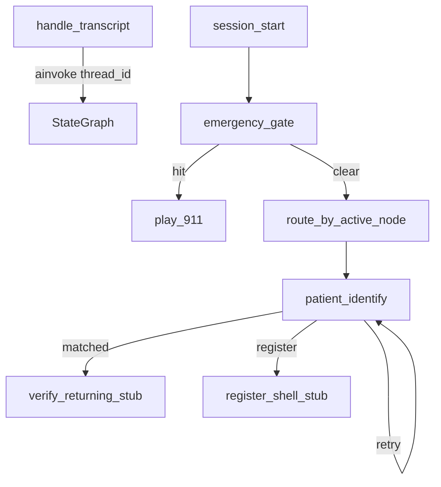

# Component 03 — Sub-plan 02: LangGraph step 0 + `PATIENT_IDENTIFY`

**Parent:** [03_orchestrator_cards.md](./03_orchestrator_cards.md) (Component 03 orchestration)  
**Discussion:** [patient_node_discussion.md](../../under%20development%20and%20discussion/Discussion/patient_node_discussion.md)  
**Overview:** Shift session + emergency into LangGraph; implement `PATIENT_IDENTIFY` with name + DOB + phone lookup, layered prompts, code-driven routing. Stub `VERIFY_RETURNING` / `REGISTER_SHELL_PROFILE` only.  
**Status:** **Complete**

---

## Context

Sub-plan 01 delivered v1 behavior **outside** LangGraph ([03_orchestrator_01_session_start_emergency_gate.md](./03_orchestrator_01_session_start_emergency_gate.md)). Sub-plan 02 **step 0** is the prerequisite from [progress.md](../../progress.md): unified `CallState`, graph nodes, thin `handle_transcript`. Then **`PATIENT_IDENTIFY`** only (verify/register full build later).

**Lookup key (locked):** `first_name` + `last_name` + `dob` + `phone` on Supabase `patients` (see [patient_node_discussion.md](../../under%20development%20and%20discussion/Discussion/patient_node_discussion.md)). LLM does **not** choose the next node — code sets `active_node` after `lookup_patient` result.

---

## Scope

| In scope | Out of scope |
|----------|----------------|
| Step 0: `CallState`, `session_start`, `EMERGENCY_GATE`, `play_911`, thin adapter | Full `VERIFY_RETURNING` / `REGISTER_SHELL_PROFILE` |
| `PATIENT_IDENTIFY`: prompts, `lookup_patient`, routing | Component 04 `ehr_server` |
| Supabase `lookup_patient` adapter | Greeting on connect |
| Stub verify/register nodes | `trigger_emergency` LLM tool (keyword gate stays primary) |
| Tests; [progress.md](../../progress.md) updates | |

---

## Implementation todos

**Git:** `git add` + `git commit` after **each commit step** below (one atomic commit per step). Do not push unless asked.

### Commit 1 — `CallState` schema

- [ ] Add [`src/orchestrator/call_state.py`](../../src/orchestrator/call_state.py): `messages`, `session_ended`, `emergency_*`, `active_node`, `patient_id`, `patient_type`, `identity_fields`, `lookup_status`, `lookup_attempts`, `last_reply`, `user_text`
- [ ] Align [`src/orchestrator/state.py`](../../src/orchestrator/state.py) / `get_session` with graph state as needed

**Commit message:** `Add CallState schema for LangGraph orchestration`

---

### Commit 2 — Prompts module

- [ ] Add [`src/orchestrator/prompts.py`](../../src/orchestrator/prompts.py): `GLOBAL_PROMPT`, `EMERGENCY_BACKUP_PROMPT`, `PATIENT_IDENTIFY_PROMPT`
- [ ] `build_system_messages(active_node)` helper

**Commit message:** `Add orchestrator prompts for global, emergency backup, and PATIENT_IDENTIFY`

---

### Commit 3 — `lookup_patient` tool

- [ ] Add [`src/orchestrator/tools/lookup_patient.py`](../../src/orchestrator/tools/lookup_patient.py): Supabase query on `patients`; normalize phone/DOB; return `{ count, patient_id? }` only (no field-level errors)
- [ ] Injectable client for tests

**Commit message:** `Add lookup_patient Supabase adapter for patient authentication`

---

### Commit 4 — Graph step 0 (session + emergency)

- [ ] Rewrite [`src/orchestrator/graph.py`](../../src/orchestrator/graph.py): `MemorySaver`, nodes `session_start`, `emergency_gate`, `play_911`
- [ ] Add [`src/orchestrator/routing.py`](../../src/orchestrator/routing.py): `route_after_emergency`

**Commit message:** `Move session_start and EMERGENCY_GATE into LangGraph`

---

### Commit 5 — `PATIENT_IDENTIFY` + routing + stubs

- [ ] Add [`src/orchestrator/nodes/`](../../src/orchestrator/nodes/): `patient_identify`, stub `verify_returning`, stub `register_shell_profile`
- [ ] LLM + `lookup_patient` tool; code updates `lookup_status`, `active_node` after tool
- [ ] Routing: 1 match → `VERIFY_RETURNING`; 0 + returning → stay (retry cap 2); 0 + new → `REGISTER_SHELL_PROFILE`; 2+ → stay

**Commit message:** `Implement PATIENT_IDENTIFY node with lookup and routing stubs`

---

### Commit 6 — Thin `handle_transcript`

- [ ] Shrink [`src/orchestrator/__init__.py`](../../src/orchestrator/__init__.py): `ainvoke` + `thread_id`; return `last_reply`
- [ ] Gateway / [`scripts/chat_terminal.py`](../../scripts/chat_terminal.py) unchanged public API

**Commit message:** `Refactor handle_transcript to thin LangGraph adapter`

---

### Commit 7 — Tests (emergency + graph)

- [ ] Update [`tests/test_handle_transcript.py`](../../tests/test_handle_transcript.py), [`tests/test_session_lifecycle.py`](../../tests/test_session_lifecycle.py)
- [ ] Add [`tests/test_graph_emergency.py`](../../tests/test_graph_emergency.py)

**Commit message:** `Update orchestrator tests for LangGraph emergency path`

---

### Commit 8 — Tests (identify routing)

- [ ] Add [`tests/test_patient_identify.py`](../../tests/test_patient_identify.py): mock lookup 0/1/2 rows + `active_node` transitions; mock LLM

**Commit message:** `Add tests for PATIENT_IDENTIFY lookup routing`

---

### Commit 9 — Docs

- [ ] Update [progress.md](../../progress.md) Step 0 + `PATIENT_IDENTIFY` checkboxes
- [ ] **Append only** Q/A to [patient_node_discussion.md](../../under%20development%20and%20discussion/Discussion/patient_node_discussion.md) pointing to this plan

**Commit message:** `Update progress for LangGraph step 0 and PATIENT_IDENTIFY`

---

## Node: `PATIENT_IDENTIFY`

| Field | Value |
|-------|--------|
| **LLM** | Yes |
| **Prompt** | Global + emergency backup + node block (discussion doc § Full prompt draft) |
| **Tools** | `lookup_patient` |
| **Enter** | `active_node = PATIENT_IDENTIFY` after emergency clear |
| **Exit** | Code: `lookup_status` + `patient_type` → `VERIFY_RETURNING`, `REGISTER_SHELL_PROFILE`, or stay |

| `lookup_patient` count | `patient_type` | Code sets `active_node` |
|------------------------|----------------|-------------------------|
| 1 | returning | `VERIFY_RETURNING` + `patient_id` |
| 0 | returning | stay `PATIENT_IDENTIFY` (retry, max 2) |
| 0 | new | `REGISTER_SHELL_PROFILE` |
| 2+ | — | stay `PATIENT_IDENTIFY` |

---

## File layout

| File | Role |
|------|------|
| `src/orchestrator/call_state.py` | `CallState` TypedDict |
| `src/orchestrator/prompts.py` | Prompt layers |
| `src/orchestrator/tools/lookup_patient.py` | Supabase lookup |
| `src/orchestrator/nodes/` | Graph node functions |
| `src/orchestrator/routing.py` | Conditional edge helpers |
| `src/orchestrator/graph.py` | Compiled `StateGraph` + checkpointer |

---

## Verification

1. `python -m unittest discover -s tests -p "test_*.py"`
2. `python scripts/chat_terminal.py` — known seeded patient → routes to verify stub
3. Wrong name/DOB/phone triple → ask again (no field hint)

---

## Risks

| Risk | Mitigation |
|------|------------|
| Live OpenAI in CI | Mock LLM in tests |
| Name parsing | v1: last token = last name; confirm spelling in prompt |
| Duplicate `_sessions` vs checkpointer | Single write path after `ainvoke` |
