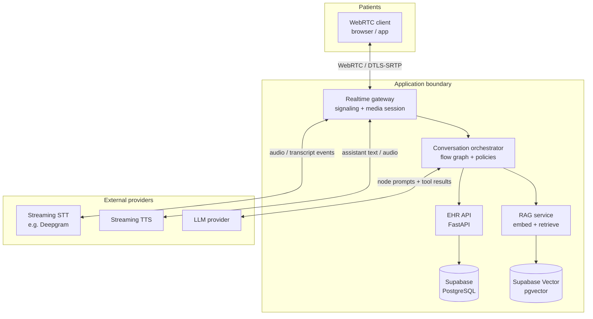

# Healthcare Patient Scheduler & Intake Voice Agent

## Overview

This repository contains the architecture and implementation plan for a production-oriented **Healthcare Patient Scheduler & Intake Voice Agent** for Mercy General. The agent acts as an AI receptionist that patients can speak with in real time to handle routine scheduling, intake, FAQ, and routing tasks while reducing front-desk workload.

The project does not rely on static mock responses. It models a realistic hospital environment with a local FastAPI EHR service, FHIR-style synthetic patient data, Supabase/PostgreSQL storage, and a Retrieval-Augmented Generation (RAG) pipeline backed by Supabase Vector / `pgvector`.

The system is designed for scheduling and intake, not diagnosis. Emergency language is handled by a mandatory safety path that interrupts the normal conversation and directs the caller to 911 or the nearest ER.

## Core Agent Features

1. **Smart Appointment Scheduling & Management**
   - Book appointments with specific doctors or departments.
   - Reschedule or cancel existing appointments over the phone.
   - Apply cross-coverage logic when the requested primary care doctor is unavailable.
   - Route ER requests appropriately without trying to schedule an ER slot.

2. **Patient Authentication & Profile Fetching**
   - Verify returning patients using basic identity information such as name, date of birth, and phone number.
   - Fetch a token-efficient patient profile from the EHR API so the agent has relevant context without exposing raw FHIR records to the LLM.

3. **New Patient Onboarding**
   - Move callers who are not found in the EHR into a lightweight registration flow.
   - Create a shell patient profile with only the minimum demographic fields needed to hold an appointment.
   - Use the backend patient creation endpoint so new patients can be scheduled immediately after registration.

4. **Conversational Medical Triage via RAG**
   - Retrieve approved hospital FAQ, policy, department, and symptom-routing content from Supabase Vector.
   - Answer only from curated knowledge base snippets and keep responses scoped to services the hospital actually supports.
   - Use RAG for safe routing and FAQ support, not diagnosis or treatment advice.

5. **Strict Emergency Guardrails**
   - Screen every finalized patient utterance for emergency language such as chest pain, trouble breathing, severe bleeding, or crisis phrases.
   - Stop the normal scheduling flow immediately when the emergency gate triggers.
   - Play a fixed escalation script instructing the caller to dial 911 or go to the nearest ER.

6. **Basic Intake & Insurance Verification**
   - Collect chief complaint, symptom duration, and basic appointment reason.
   - Gather basic insurance provider details for downstream billing context.

## Main System Design

The architecture uses a **flow-based outer graph** for predictable healthcare workflow control and a **tool-calling LLM inside each node** for flexible conversation. The orchestrator, not the LLM, owns policy enforcement, emergency handling, tool allowlists, confirmation checks, and appointment commits.



### Component Responsibilities

| Component | Responsibility |
| --------- | -------------- |
| WebRTC client | Captures and plays audio, manages call controls, and connects to the realtime gateway. |
| Realtime gateway | Handles signaling, media routing, streaming STT/TTS adapters, session heartbeat, and barge-in events. |
| Conversation orchestrator | Tracks graph state, runs emergency gates, restricts tools by node, requires confirmations, and writes audit events. |
| EHR API | Owns patient lookup, profile summary, providers, availability, appointment commits, and server-side validation. |
| RAG service | Embeds user questions, retrieves scoped knowledge chunks, and returns citations/snippets to the orchestrator. |
| Supabase/PostgreSQL | Stores patients, providers, appointments, clinical summaries, and operational data. |
| Supabase Vector / `pgvector` | Stores curated knowledge base embeddings for FAQ and routing support. |

### Call Lifecycle

1. The patient starts a WebRTC session through the client.
2. The realtime gateway binds media and signaling to a `session_id`.
3. The orchestrator sends a greeting and starts the conversation graph.
4. Each patient utterance is transcribed by streaming STT.
5. The orchestrator runs the emergency gate before normal graph advancement.
6. If safe, the active node calls the LLM with only the tools allowed for that node.
7. EHR and RAG tools return structured results that the LLM can summarize to the patient.
8. Booking, cancellation, or rescheduling only commits after explicit user confirmation and server-side validation.
9. The system wraps up, hands off, or ends the session based on the graph outcome.

### Safety and Trust Guarantees

- **Emergency-first:** emergency screening runs before regular scheduling or FAQ behavior.
- **No diagnosis:** the system provides intake, routing, and FAQ responses, not clinical diagnosis, prescriptions, or definitive treatment advice.
- **Deterministic commits:** appointment mutations require explicit confirmation and idempotent EHR API writes.
- **Least-data LLM context:** raw FHIR records stay behind the EHR boundary; the LLM receives minimized summaries only.
- **Human handoff:** repeated failures, user requests, out-of-scope clinical demands, or backend errors can route to staff.
- **Auditable behavior:** key events such as verification, availability shown, appointment committed, emergency triggered, and handoff are logged in structured form without unnecessary PHI.

## Technology Stack

### Voice and Realtime

- **WebRTC:** Primary v1 transport for low-latency bidirectional audio.
- **Streaming STT:** Deepgram or equivalent low-latency transcription provider.
- **Streaming TTS:** Converts assistant text into natural speech with support for interruption and cached safety prompts.
- **Optional PSTN bridge:** A phone-network adapter such as Vapi can be added later without changing the core orchestrator contract.

### Backend and Data

- **FastAPI EHR service:** Simulated EHR boundary for patients, providers, appointments, availability, and profile summaries.
- **FHIR-style synthetic data:** Realistic but fake patient/provider data generated from Synthea.
- **Supabase/PostgreSQL:** Application data store for EHR-like entities and operational records.
- **Supabase Vector / `pgvector`:** Vector search over curated Mercy General knowledge base files.
- **Python scripts:** Utilities for downloading seed data, preparing embeddings, and loading RAG content.

## Project Structure

- `data/`: Seed data and curated RAG knowledge.
  - `fhir/`: Realistic mock patient and provider JSON bundles from Synthea.
  - `healthcare_qa.csv`: Legacy tiny medical Q&A dataset kept for reference.
  - `knowledge_base/`: Primary RAG source for Mercy General policy, department services, FAQ, appointment prep, and safe care routing.
- `docs/`: Product and feature documentation, including `docs/features.md`.
- `scripts/`: Utility scripts for downloading datasets, models, and preparing Supabase/RAG assets.
- `system design/`: Source architecture documents for the main design and component-level design.
- `Rag Evaluation/`: Placeholder area for RAG quality and retrieval evaluation work.

## System Design Documents

Start with the main design, then read the component documents in order:

1. [`system design/01-main-system-design.md`](system%20design/01-main-system-design.md) - end-to-end architecture, deployment view, call lifecycle, and trust principles.
2. [`system design/02-component-voice-realtime.md`](system%20design/02-component-voice-realtime.md) - WebRTC, signaling, media, STT/TTS streaming, latency, and barge-in.
3. [`system design/03-component-orchestration.md`](system%20design/03-component-orchestration.md) - flow graph, emergency gate, tool allowlists, confirmations, and handoff.
4. [`system design/04-component-backend-ehr.md`](system%20design/04-component-backend-ehr.md) - FastAPI EHR service responsibilities, endpoint map, validation, and errors.
5. [`system design/05-component-data-rag.md`](system%20design/05-component-data-rag.md) - Supabase schema, RAG ingestion/retrieval, privacy, and rollback.
6. [`system design/06-trust-security-operations.md`](system%20design/06-trust-security-operations.md) - security posture, audit events, SLOs, incidents, and customer-facing assurances.

## Setup & Installation

1. **Clone the repository and navigate to the directory:**

   ```bash
   cd "Voice Agent"
   ```

2. **Set up a Python virtual environment:**

   ```bash
   python -m venv venv

   # Windows
   .\venv\Scripts\activate

   # macOS/Linux
   source venv/bin/activate
   ```

3. **Install dependencies:**

   ```bash
   pip install -r requirements.txt
   ```

4. **Acquire seed data:**

   ```bash
   python scripts/download_qa_data.py
   python scripts/download_synthea_data.py
   ```

5. **Prepare the local RAG/vector assets as needed:**

   ```bash
   python scripts/download_embedding_model.py
   ```

   The Supabase vector database setup is documented in `scripts/supabase_rag_vector_db.sql`.

## Current Status

- **Phase 1 complete:** Seed data acquisition is complete, and the curated Mercy General policy knowledge base is available under `data/knowledge_base/`.
- **Phase 2 in progress:** Building the local EHR service and Supabase Vector RAG pipeline so the voice agent can make live API queries during patient calls.
- **Architecture baseline complete:** The main system design and component documents define the WebRTC transport, orchestration graph, EHR API boundary, RAG pipeline, and production trust posture.
