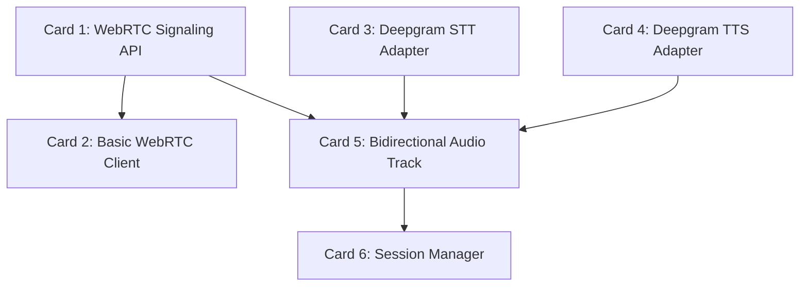

# Component 02: Voice & Realtime Layer - Feature Board

This board breaks down the WebRTC and STT/TTS component into manageable "cards". Some cards can be built independently, while others depend on previous cards being completed.

## Dependency Graph (Connections)

---

## 🟢 Independent Feature Cards (Can be built immediately)

### [x] Card 1: WebRTC Signaling API
*   **Goal**: Create the entry point for the browser to connect to the backend.
*   **Tasks**:
    *   Create `src/gateway/server.py`.
    *   Add a FastAPI `POST /webrtc/offer` endpoint.
    *   Initialize `aiortc.RTCPeerConnection` and process the SDP offer/answer.
*   **Dependencies**: None.

### [x] Card 3: Deepgram STT Adapter
*   **Goal**: Connect to Deepgram's Live streaming API to convert audio to text.
*   **Tasks**:
    *   Create `src/adapters/stt_deepgram.py`.
    *   Establish an async WebSocket connection to Deepgram.
    *   Implement async generators to emit `transcript.partial` and `transcript.final` events.
*   **Dependencies**: None *(Requires Deepgram API Key)*.

### [ ] Card 4: Deepgram TTS Adapter
*   **Goal**: Connect to Deepgram's Aura API to convert agent text into speech.
*   **Tasks**:
    *   Create `src/adapters/tts_deepgram.py`.
    *   Take text chunks and return streaming audio bytes.
*   **Dependencies**: None *(Requires Deepgram API Key)*.

---

## 🟡 Dependent Feature Cards (Require other cards first)

### [x] Card 2: Basic WebRTC Client
*   **Goal**: Build the browser UI to test the signaling API.
*   **Tasks**:
    *   Update `client/index.html` and `client/app.js`.
    *   Request microphone permissions via `getUserMedia`.
    *   Create a browser `RTCPeerConnection` and send the SDP offer to the backend.
*   **Dependencies**: Requires **Card 1** to be finished.

### [/] Card 5: Bidirectional Audio Track
*   **Goal**: The core audio router. Connects the browser's audio to the AI stack.
*   **Tasks**:
    *   Create `src/gateway/audio_track.py`.
    *   Inherit from `aiortc.MediaStreamTrack`.
    *   **Inbound**: Route WebRTC mic audio to Card 3 (STT).
    *   **Outbound**: Route Card 4 (TTS) audio to the WebRTC speaker.
*   **Dependencies**: Requires **Card 1**, **Card 3**, and **Card 4**.

### [ ] Card 6: Session Manager
*   **Goal**: Manage the lifecycle of a call and emit system events.
*   **Tasks**:
    *   Create `src/gateway/session.py`.
    *   Bind the PeerConnection, Audio Track, and Orchestrator events together.
    *   Handle client disconnects and garbage collection/cleanup.
*   **Dependencies**: Requires **Card 5**.
