# Orchestrator Node Diagrams

This file is a diagram-only companion to [tools.md](./tools.md). It follows the current system design without changing node or tool definitions.

---

## Complete Agent Flow — Nodes Only

This diagram shows the outer orchestrator flow only. It intentionally does **not** show tools.

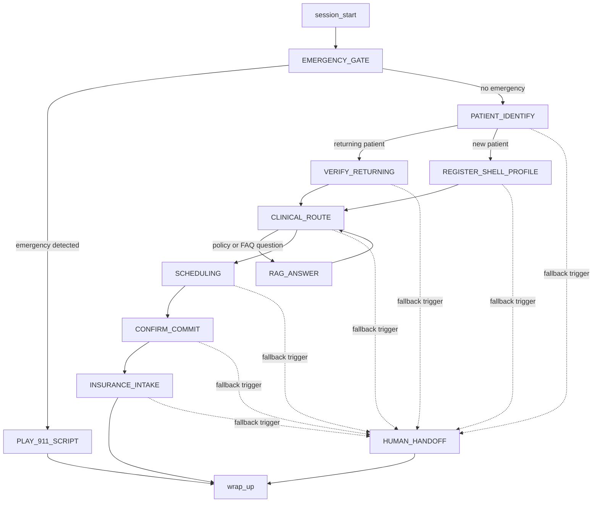

---

## Per-Node Tool Diagrams

These diagrams mirror the current tool allowlists in [tools.md](./tools.md). Nodes with no LLM tools are shown explicitly.

### `session_start`

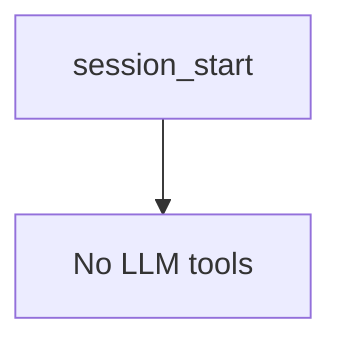

### `EMERGENCY_GATE`

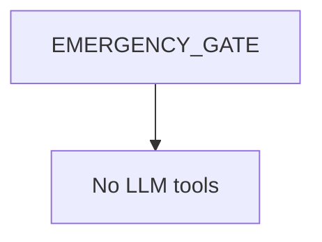

### `PLAY_911_SCRIPT`

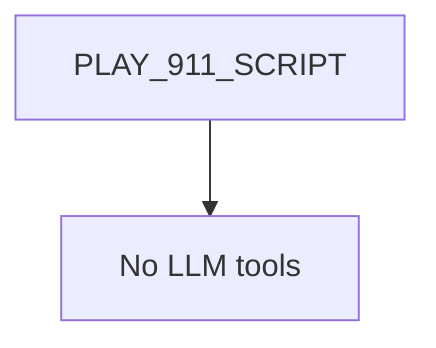

### `PATIENT_IDENTIFY`

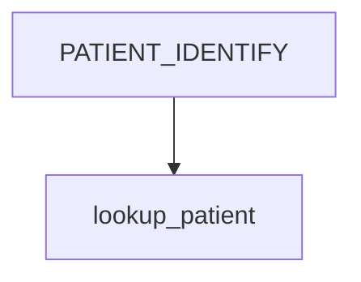

### `VERIFY_RETURNING`

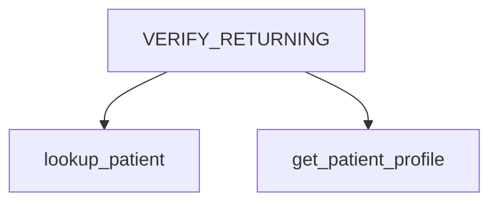

### `REGISTER_SHELL_PROFILE`

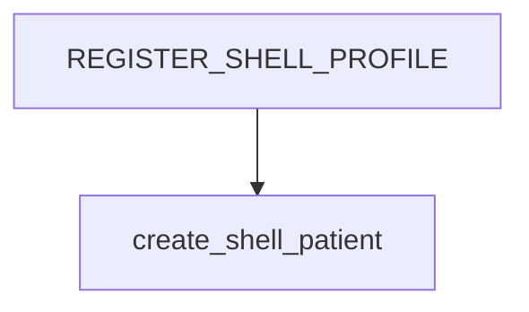

### `CLINICAL_ROUTE`

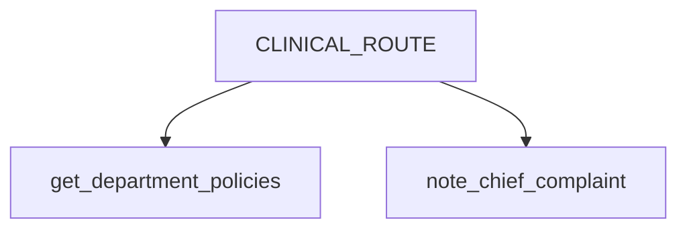

### `SCHEDULING`

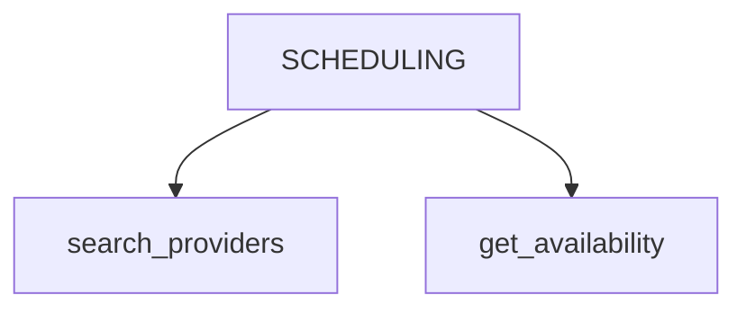

### `CONFIRM_COMMIT`

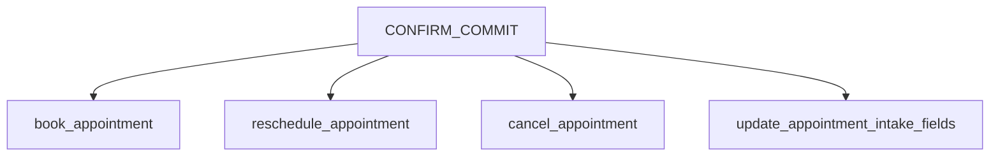

### `RAG_ANSWER`

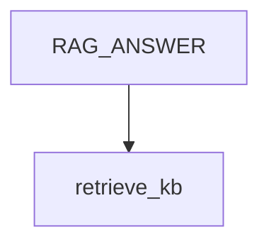

### `INSURANCE_INTAKE`

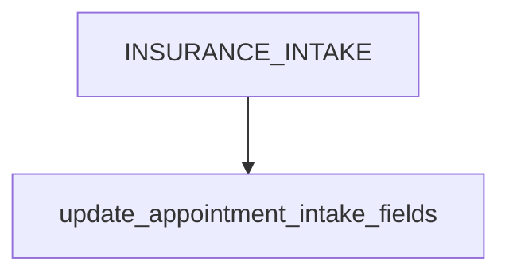

### `wrap_up`

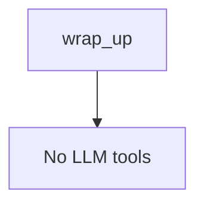

### `HUMAN_HANDOFF`

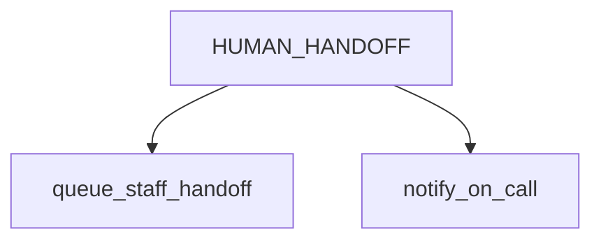

---

## Tool Association Note

`end_session` is listed in the tool catalog in [tools.md](./tools.md), but it is described there as possibly orchestrator-direct rather than an LLM tool. It is therefore not shown as an allowlisted LLM tool for a node in these diagrams.
