# Orchestrator Node Diagrams

This file is a diagram-only companion to [tools.md](./tools.md). It follows the current system design without changing node or tool definitions.

---

## Complete Agent Flow — Nodes Only

This diagram shows the outer orchestrator flow only. It intentionally does **not** show tools.

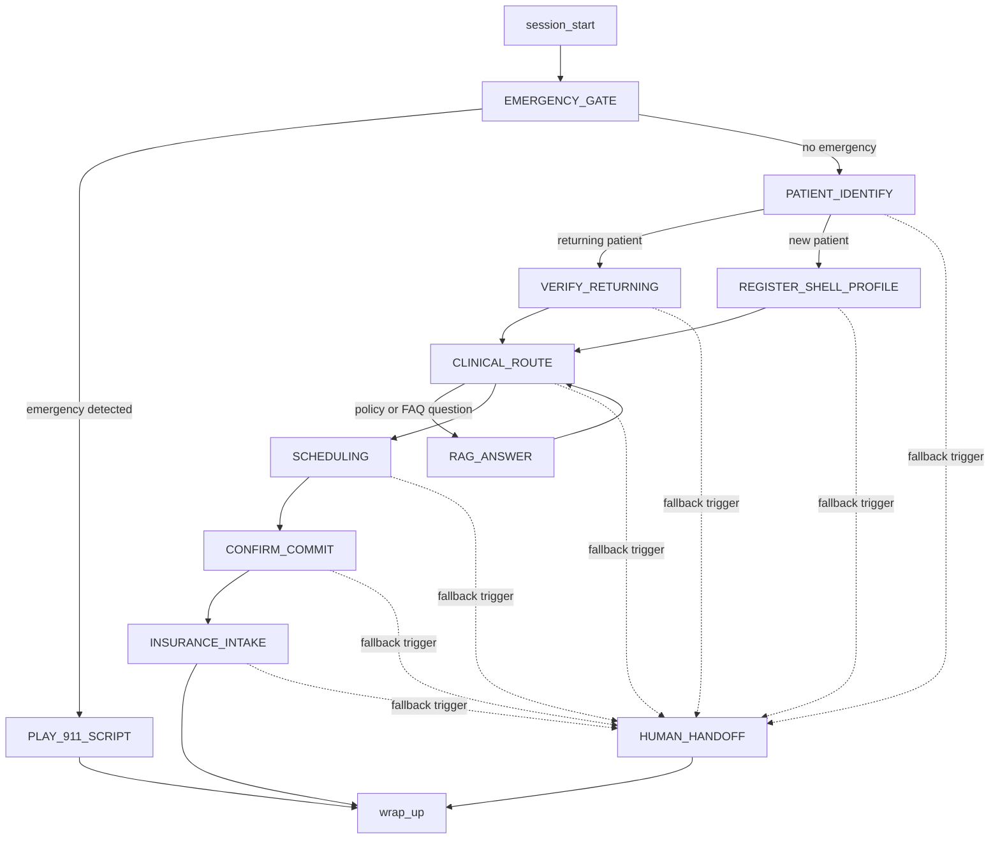

---

## Per-Node Tool Diagrams

These diagrams mirror the current tool allowlists in [tools.md](./tools.md). Nodes with no LLM tools are shown explicitly.

### `session_start`

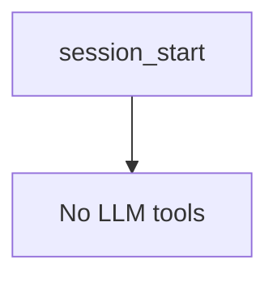

### `EMERGENCY_GATE`

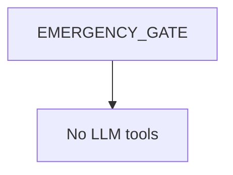

### `PLAY_911_SCRIPT`

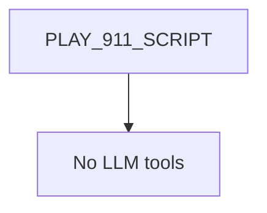

### `PATIENT_IDENTIFY`

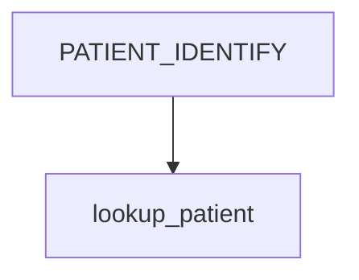

### `VERIFY_RETURNING`

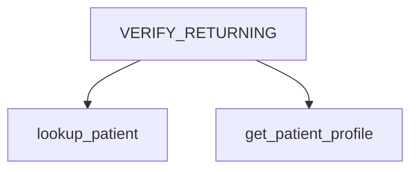

### `REGISTER_SHELL_PROFILE`

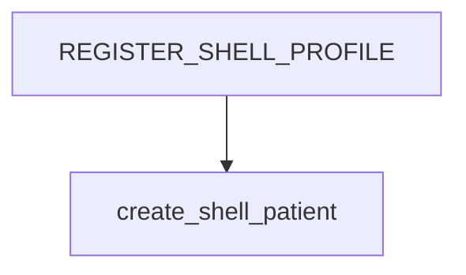

### `CLINICAL_ROUTE`

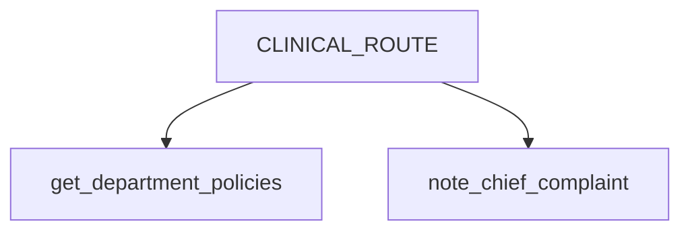

### `SCHEDULING`

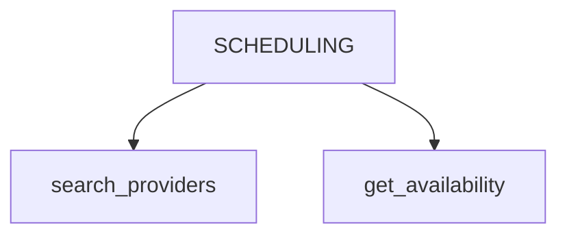

### `CONFIRM_COMMIT`

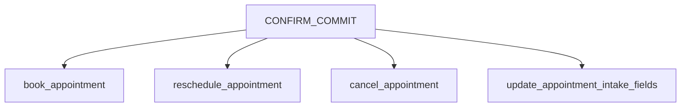

### `RAG_ANSWER`

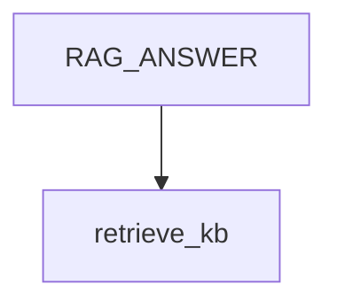

### `INSURANCE_INTAKE`

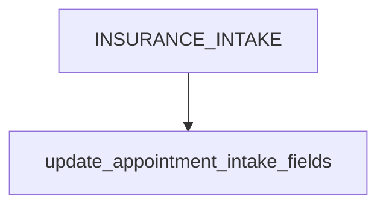

### `wrap_up`

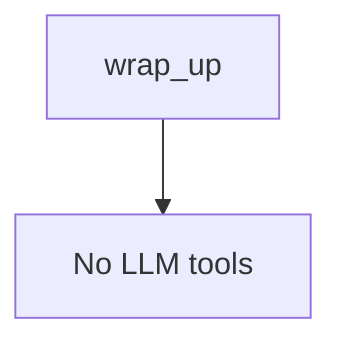

### `HUMAN_HANDOFF`

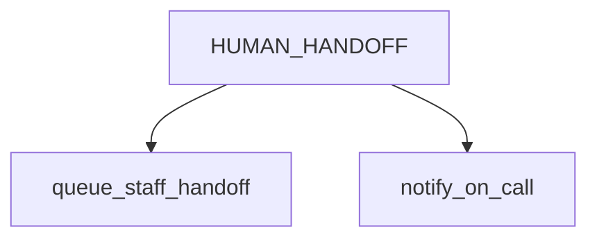

---

## Node And Tool Responsibilities

This section explains each node in the agent flow, followed by the tools available inside that node.

### `session_start`

**Node work:** Starts the voice session, attaches the `session_id`, and loads any persisted orchestrator state if the session is being resumed.

**Tools:** No LLM tools.

### `EMERGENCY_GATE`

**Node work:** Runs before graph advancement on every finalized user utterance. It checks for emergency language and routes emergency cases to `PLAY_911_SCRIPT`.

**Tools:** No LLM tools. This node is deterministic, with an optional internal classifier service outside the LLM tool allowlist.

### `PLAY_911_SCRIPT`

**Node work:** Plays the emergency script, records the emergency event for audit, and moves the session toward termination.

**Tools:** No LLM tools.

### `PATIENT_IDENTIFY`

**Node work:** Determines whether the caller is calling for themself or someone else, and whether the patient is returning or new. It collects identifying fields such as name, date of birth, and phone when needed.

**Tools:**

- `lookup_patient`: Looks up a patient by completed identity fields, such as name, date of birth, and phone.

### `VERIFY_RETURNING`

**Node work:** Verifies a returning patient and loads the verified patient context before clinical routing.

**Tools:**

- `lookup_patient`: Confirms the patient exists and resolves the patient record.
- `get_patient_profile`: Loads token-efficient clinical context after successful verification.

### `REGISTER_SHELL_PROFILE`

**Node work:** Collects the minimum required demographics and insurance information for a new patient, then creates a shell patient profile.

**Tools:**

- `create_shell_patient`: Creates the new patient shell profile after required fields are collected.

### `CLINICAL_ROUTE`

**Node work:** Collects the reason for visit, identifies routing needs such as acute versus chronic concerns, captures chief complaint context, and determines whether policy or FAQ help is needed.

**Tools:**

- `get_department_policies`: Reads referral, department, and booking policy notes used for safe routing.
- `note_chief_complaint`: Persists chief complaint and duration information for the pre-brief or appointment context.

### `RAG_ANSWER`

**Node work:** Answers scoped policy or FAQ questions using the knowledge base, then returns control to `CLINICAL_ROUTE`.

**Tools:**

- `retrieve_kb`: Retrieves approved knowledge-base content for safe FAQ, policy, and routing language.

### `SCHEDULING`

**Node work:** Searches providers and available slots, presents scheduling options, and handles cross-coverage UX. It does not commit bookings.

**Tools:**

- `search_providers`: Finds providers by name, specialty, or department.
- `get_availability`: Gets provider availability and slot options with server-side scheduling rules.

### `CONFIRM_COMMIT`

**Node work:** Presents the canonical appointment summary, requires explicit user confirmation, and performs appointment mutations only after confirmation.

**Tools:**

- `book_appointment`: Books a confirmed appointment with idempotency protection.
- `reschedule_appointment`: Reschedules an existing appointment after confirmation.
- `cancel_appointment`: Cancels an existing appointment after confirmation.
- `update_appointment_intake_fields`: Updates appointment-related intake fields when booking and intake persistence are split.

### `INSURANCE_INTAKE`

**Node work:** Collects insurance and logistics information needed after appointment confirmation and persists it to appointment context.

**Tools:**

- `update_appointment_intake_fields`: Saves insurance and intake fields on the appointment or related record.

### `wrap_up`

**Node work:** Gives the final confirmation summary and ends the normal conversation flow.

**Tools:** No LLM tools.

### `HUMAN_HANDOFF`

**Node work:** Handles fallback or escalation when staff support is needed, such as user request, repeated ASR failure, out-of-scope needs, or backend exhaustion.

**Tools:**

- `queue_staff_handoff`: Creates or queues a staff handoff request.
- `notify_on_call`: Optionally notifies an on-call person or escalation channel.

---

## Tool Association Note

`end_session` is listed in the tool catalog in [tools.md](./tools.md), but it is described there as possibly orchestrator-direct rather than an LLM tool. It is therefore not shown as an allowlisted LLM tool for a node in these diagrams.
