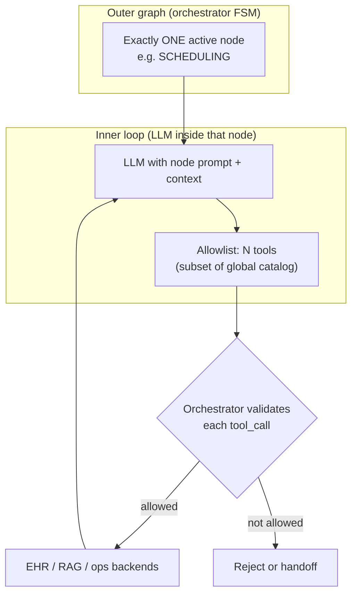
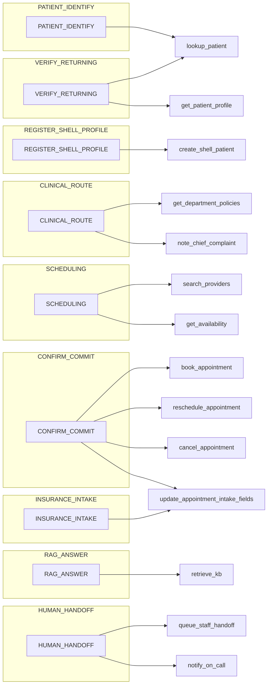
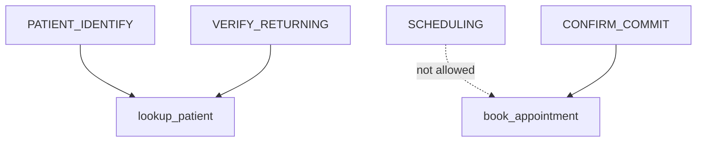

# Orchestrator: graph nodes & LLM tools

This document defines the **outer graph nodes** (conversation orchestration) and the **inner LLM tools** (allowlisted per node) for the Healthcare Patient Scheduler & Intake Voice Agent. It consolidates the [PRD](../../PRD.md), [Component 03 — conversation orchestration](../../system%20design/03-component-orchestration.md), [Component 04 — EHR backend](../../system%20design/04-component-backend-ehr.md), and [core features](../../docs/features.md).

**Pattern:** Flow / node graph (outer) + tool-calling LLM (inner). The orchestrator validates every tool call against the active node’s allowlist and server-side rules.

---

## 0. Nodes vs tools (what maps to what)

**Tools are not nodes, and nodes are not tools.** They live at two different layers:

| Layer | What it is | Cardinality |
|-------|----------------|-------------|
| **Node** | An **outer graph step** the orchestrator is in (policy stage: who may be scheduled, whether commits are legal, etc.). | **Exactly one** active node per session at a time. |
| **Tool** | An **inner capability** the LLM may **invoke** (function call) to read/write EHR, query RAG, or hand off. | **Many tools** can be allowlisted **per node**; the model may call **zero, one, or many** tools in a single turn before speaking. |

So the design is: **one node → an allowlist of tools (often 1–4; sometimes 0).** The LLM always runs **inside** the current node; it never “replaces” the graph. The orchestrator advances **nodes** on transitions (e.g. user confirmed slot → move to `CONFIRM_COMMIT`); it **filters** which **tools** exist in that node.

**Special cases:**

- **`EMERGENCY_GATE`:** typically **no** LLM tools—keyword / small classifier + hard transition.  
- **`PLAY_911_SCRIPT` / `wrap_up`:** orchestrator-driven audio or copy; **no** tool menu unless you explicitly add telemetry-only hooks.  
- **Dangerous writes** (e.g. `book_appointment`): appear **only** in `CONFIRM_COMMIT`, not in `SCHEDULING`, even though both are “about” scheduling.

### Mermaid — layers: one active node, many possible tools

### Mermaid — node → allowed tools (summary map)

*Edges mean “this tool may be offered to the LLM while in this node.” Some nodes intentionally expose **no** tools.*

### Mermaid — same tool, different nodes (optional overlap)

`lookup_patient` is allowlisted in more than one node; **booking** tools stay isolated.

Legend: solid edge = tool is in the allowlist; dotted = **intentionally omitted** so the model cannot book from the scheduling node.

---

## 1. Outer graph nodes (orchestrator)

| Node ID | Purpose | PRD / feature tie-in |
|--------|---------|----------------------|
| `session_start` | Session bootstrap; attach `session_id`, load persisted state if any. | Infrastructure for all features. |
| `EMERGENCY_GATE` | Deterministic keyword (± optional classifier) on **every** finalized utterance; on hit → `PLAY_911_SCRIPT` and terminate. | Feature 5; PRD §5 state 0. |
| `PLAY_911_SCRIPT` | Play 911 script; end session; audit `emergency_triggered`. | Feature 5. |
| `PATIENT_IDENTIFY` | Self vs other; returning vs new; collect name + DOB (+ phone path for returning). | Feature 2; PRD state 1. |
| `VERIFY_RETURNING` | Drive identity verification; on success load clinical context. | Feature 2. |
| `REGISTER_SHELL_PROFILE` | Collect minimum demographics + insurance as required; create shell patient. | Feature 3; PRD state 1 → POST `/patients`. |
| `CLINICAL_ROUTE` | Reason for visit; acute vs chronic; referral hints; chief complaint / duration for pre-brief. | Feature 4 (routing), Feature 6 (symptom prelude); PRD state 2. |
| `SCHEDULING` | Search providers, show slots, cross-coverage UX; **no** booking commit here. | Feature 1; PRD state 3. |
| `CONFIRM_COMMIT` | Canonical summary; require affirmative confirmation; **only** node that mutates appointments (with idempotency). | Feature 1; PRD + 03 §6. |
| `RAG_ANSWER` | Scoped FAQ / policy retrieval; returns control to `CLINICAL_ROUTE` (spoke). | Feature 4; no diagnosis / no promises. |
| `INSURANCE_INTAKE` | Insurance provider + logistics reminders; persist to appointment / context. | Feature 6; PRD state 4. |
| `wrap_up` | Confirmation summary; session end. | All flows. |
| `HUMAN_HANDOFF` | Queue / notify staff; graceful close when triggers fire. | PRD graceful fallback; 03 §7. |

**Non-negotiable:** `EMERGENCY_GATE` runs before advancing the graph on new user text.

---

## 2. LLM tool catalog (names ↔ system boundaries)

Tools are **thin adapters** over the EHR API, RAG service, and ops hooks. Exact JSON schemas should match OpenAPI / function-calling definitions in implementation.

### 2.1 Patient & profile (EHR)

| Tool name (suggested) | Maps to EHR | Used for |
|----------------------|-------------|----------|
| `lookup_patient` | `GET /patients/lookup` | Name + DOB + phone → `patient_id` or not found. |
| `get_patient_profile` | `GET /patients/{id}/profile` | Token-efficient `clinical_data` for LLM context after verify. |
| `create_shell_patient` | `POST /patients` | New patient shell profile (Feature 3). |

### 2.2 Providers & availability (EHR)

| Tool name (suggested) | Maps to EHR | Used for |
|----------------------|-------------|----------|
| `search_providers` | `GET /providers` | Query by `name`, `specialty`, `department`. |
| `get_availability` | `GET /providers/availability` | Slots with **server-side** cross-coverage / ER walk-in rules (Feature 1). |

### 2.3 Appointments — mutations (EHR, idempotent)

| Tool name (suggested) | Maps to EHR | Used for |
|----------------------|-------------|----------|
| `book_appointment` | `POST /appointments` | **Only** after explicit user confirmation; `Idempotency-Key` per 03 §6. |
| `reschedule_appointment` | `PATCH /appointments/{id}` | Same confirmation + idempotency rules. |
| `cancel_appointment` | `DELETE` or `POST /appointments/{id}/cancel` | Same; pick one HTTP style in OpenAPI. |

### 2.4 Routing, intake, and policy (orchestrator + EHR / sidecar)

| Tool name (suggested) | Backend | Used for |
|----------------------|---------|----------|
| `get_department_policies` | EHR read or config service | Referral / department booking notes (align with `04` validation rules). |
| `note_chief_complaint` | Orchestrator → persistence / EHR extension | Chief complaint + duration for pre-brief (Feature 6). |
| `update_appointment_intake_fields` | PATCH appointment or related record | Insurance + intake fields on appointment (Feature 6; PRD §5 Feature 6). |

*Implementation note:* If `note_chief_complaint` / intake updates are not yet on EHR, the orchestrator may persist to Supabase `appointments` per PRD until API parity exists.

### 2.5 Knowledge (RAG)

| Tool name (suggested) | Backend | Used for |
|----------------------|---------|----------|
| `retrieve_kb` | Supabase Vector / RAG pipeline | Scoped FAQ, policy, safe routing language (Feature 4). |

### 2.6 Human handoff & session (ops)

| Tool name (suggested) | Backend | Used for |
|----------------------|---------|----------|
| `queue_staff_handoff` | Queue / ticketing integration | User request, repeated ASR failure, out-of-scope, EHR exhaustion (03 §7). |
| `notify_on_call` | Pager / on-call hook | Optional escalation path. |
| `end_session` | Gateway | Normal or emergency termination (may be orchestrator-direct, not LLM). |

---

## 3. Tool allowlists by node (enforced by orchestrator)

| Node | Allowed tools |
|------|----------------|
| `EMERGENCY_GATE` | *None* (deterministic; optionally internal classifier service, not LLM tools). |
| `PATIENT_IDENTIFY` | `lookup_patient` (when fields complete); **do not** expose `get_patient_profile` until identity path chosen. |
| `VERIFY_RETURNING` | `lookup_patient`, `get_patient_profile` (after successful lookup). |
| `REGISTER_SHELL_PROFILE` | `create_shell_patient` (after required fields collected). |
| `CLINICAL_ROUTE` | `get_department_policies`, `note_chief_complaint` (and read-only context already in prompt). |
| `SCHEDULING` | `search_providers`, `get_availability` **only** — no `book_*` / `reschedule_*` / `cancel_*`. |
| `CONFIRM_COMMIT` | `book_appointment`, `reschedule_appointment`, `cancel_appointment`, `update_appointment_intake_fields` (if booking + intake atomicity is split, enforce ordering in orchestrator). |
| `RAG_ANSWER` | `retrieve_kb` **only** (scoped corpus + content rules). |
| `INSURANCE_INTAKE` | `update_appointment_intake_fields` (and clarifying reads if exposed as read tools in same node). |
| `HUMAN_HANDOFF` | `queue_staff_handoff`, `notify_on_call` (optional); no EHR mutations unless transferring an in-flight booking with product-defined policy. |

**Rule (from 03):** `book_appointment` is **not** available in `SCHEDULING` — only in `CONFIRM_COMMIT` after UX rules and explicit confirmation.

---

## 4. Feature → node / tool traceability

| Feature (docs/features.md) | Primary nodes | Primary tools |
|----------------------------|---------------|----------------|
| 1 — Scheduling & management | `SCHEDULING`, `CONFIRM_COMMIT` | `search_providers`, `get_availability`, `book_appointment`, `reschedule_appointment`, `cancel_appointment` |
| 2 — Auth & profile | `PATIENT_IDENTIFY`, `VERIFY_RETURNING` | `lookup_patient`, `get_patient_profile` |
| 3 — New patient onboarding | `REGISTER_SHELL_PROFILE` | `create_shell_patient` |
| 4 — Triage (RAG) | `CLINICAL_ROUTE` ↔ `RAG_ANSWER` | `retrieve_kb`; optional `get_department_policies` |
| 5 — Emergency guardrails | `EMERGENCY_GATE`, `PLAY_911_SCRIPT` | None (policy-driven termination) |
| 6 — Intake & insurance | `CLINICAL_ROUTE`, `INSURANCE_INTAKE`, `CONFIRM_COMMIT` | `note_chief_complaint`, `update_appointment_intake_fields` |

---

## 5. Implementation checklist

- [ ] Register all tools in the voice agent’s function-calling schema with **node-scoped** allowlists.
- [ ] Wire tools to `ehr_server.py` routes per [04-component-backend-ehr.md](../../system%20design/04-component-backend-ehr.md).
- [ ] Enforce **idempotency** and structured error → safe phrase mapping on all mutating appointment tools.
- [ ] Persist orchestrator state (`node`, proposed slots, `patient_id`) with TTL per 03 §8.
- [ ] Log emergency events with **reason class** per retention policy; avoid raw PHI in logs.

When this behavior is shipped and stable, consider moving this file to `docs/` or `system design/` per [active_features/README.md](../README.md).
