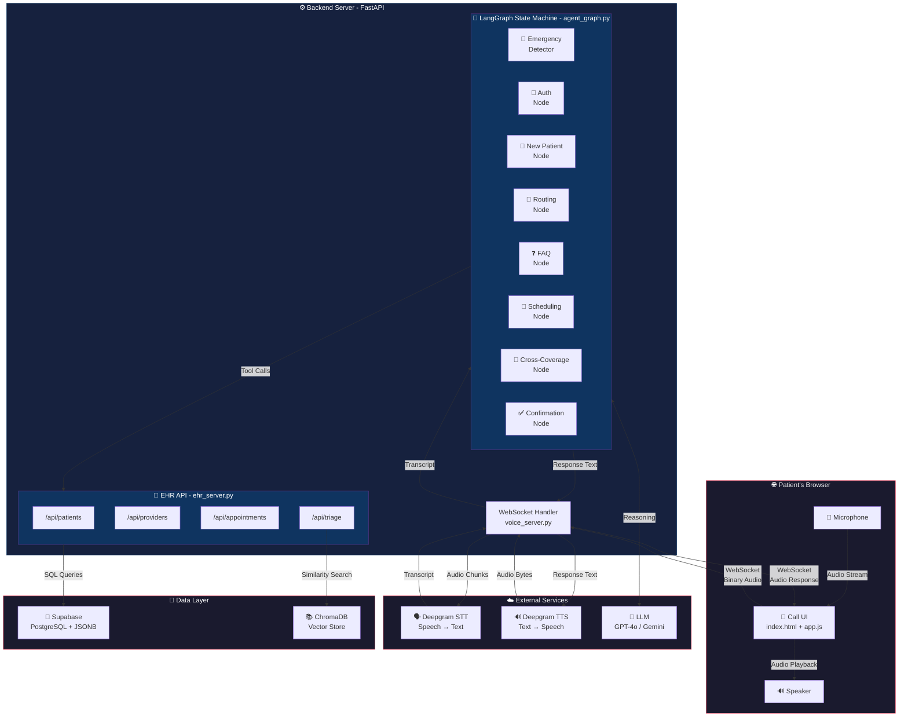
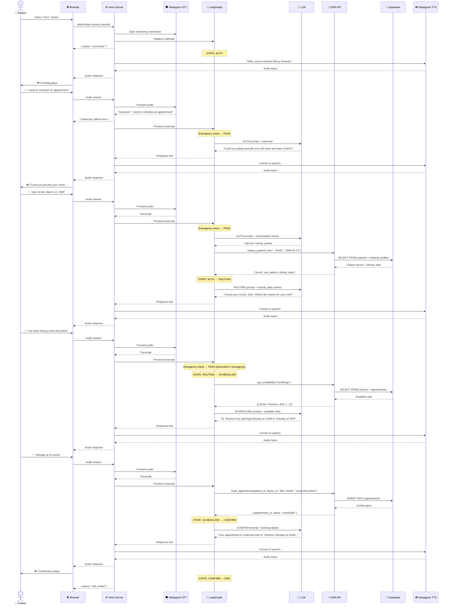
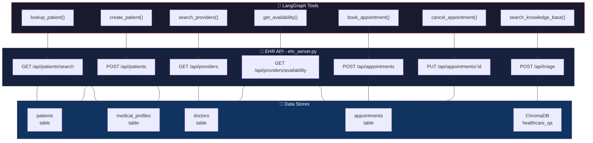
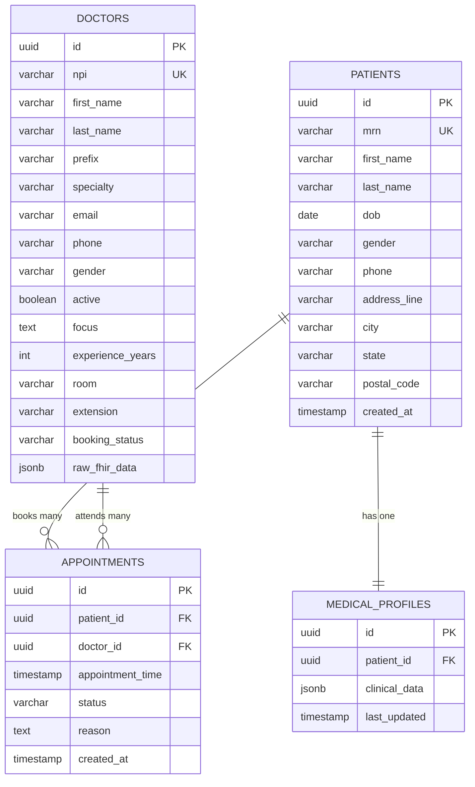
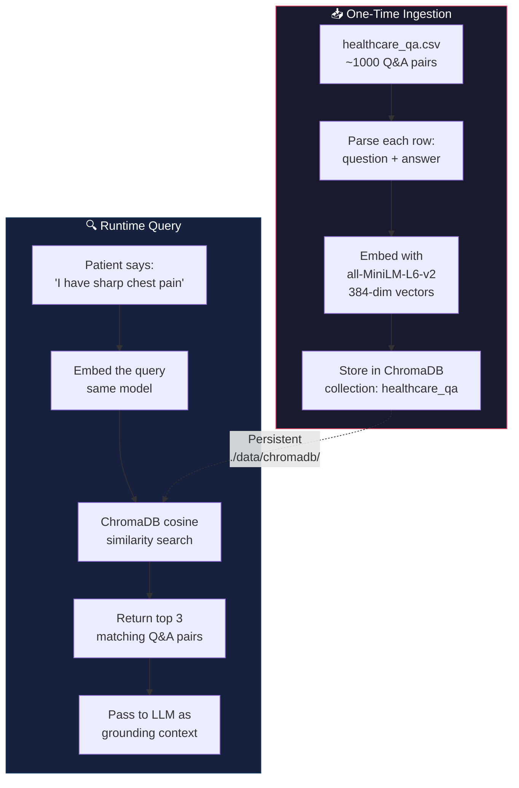
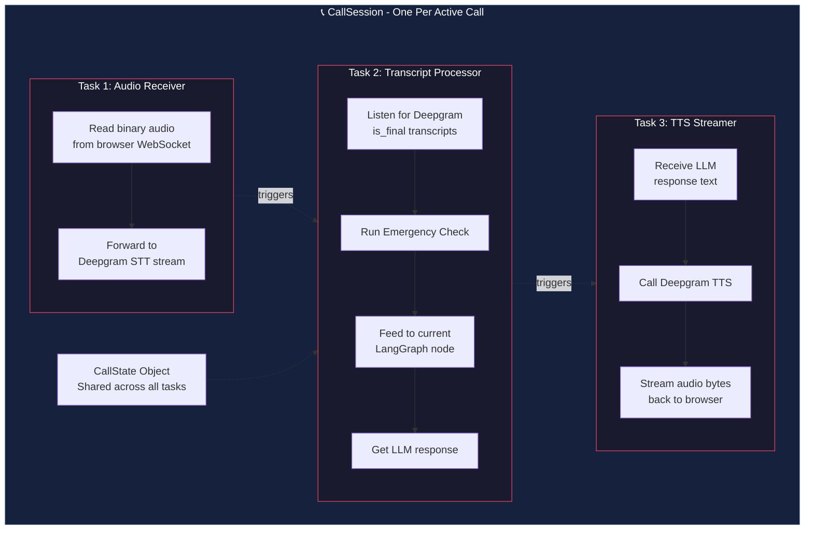
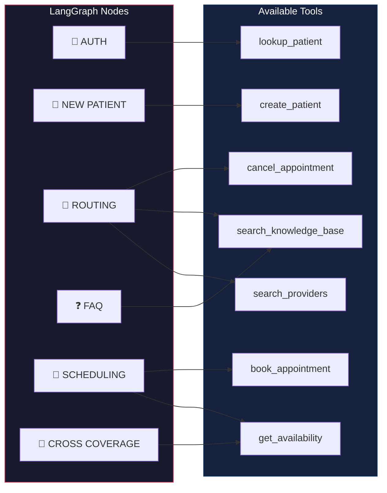
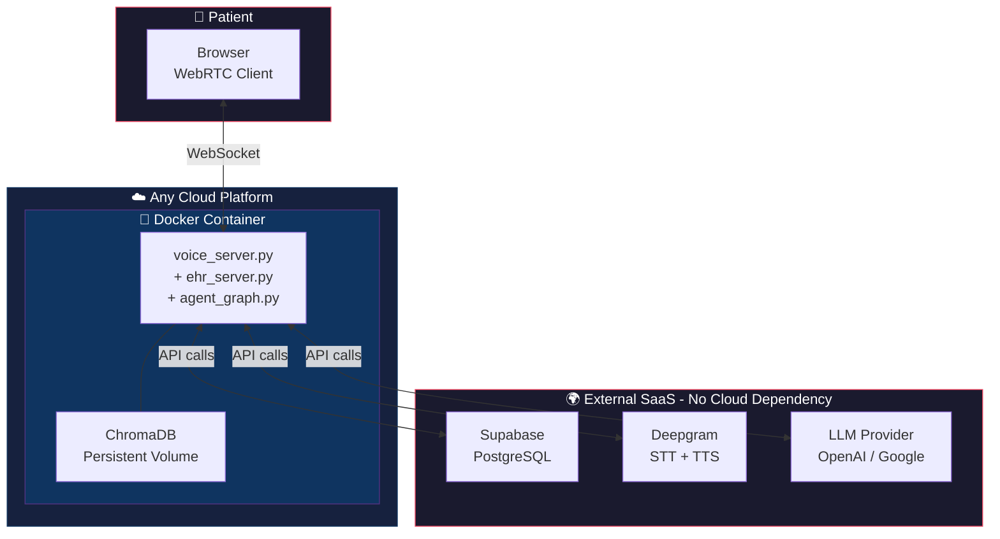

# Architecture Diagrams — Healthcare Voice Agent
**Version:** 1.0 | **Last Updated:** May 5, 2026

> Visual blueprint of the entire system. Each section has a Mermaid diagram followed by an explanation.

---

## 1. Complete System Architecture

This is the bird's-eye view. Every box is a service, every arrow is a data flow.



### Explanation

The system has **4 layers**:

1. **Browser** — The patient opens a web page, clicks "Call", and speaks into their microphone. Audio is streamed to the backend via WebSocket. Agent responses are played back through the speaker.

2. **Backend Server** — A single FastAPI process running three sub-systems:
   - **WebSocket Handler** (`voice_server.py`) — The traffic controller. Receives audio from the browser, sends it to Deepgram for transcription, feeds transcripts into LangGraph, and sends audio responses back.
   - **LangGraph State Machine** (`agent_graph.py`) — The conversation brain. Decides what to say and which tools to call based on the current conversation state.
   - **EHR API** (`ehr_server.py`) — The hospital database interface. REST endpoints that LangGraph tools call to look up patients, find doctors, and book appointments.

3. **External Services** — Third-party APIs we call:
   - **Deepgram STT** — Converts patient speech to text in real-time (~300ms)
   - **Deepgram TTS** — Converts agent text responses back to natural speech (~300ms)
   - **LLM** — The reasoning engine inside each LangGraph node (~800ms)

4. **Data Layer** — Where information lives:
   - **Supabase** — 4 PostgreSQL tables (doctors, patients, medical_profiles, appointments)
   - **ChromaDB** — Vector database holding medical Q&A embeddings for triage

---

## 2. LangGraph State Machine

This is the core of the agent. Each box is a **node** (a focused LLM call), each arrow is an **edge** (a transition rule you define).

```mermaid
stateDiagram-v2
    [*] --> AUTH

    state "🚨 EMERGENCY CHECK" as EC {
        note right of EC
            Runs on EVERY utterance
            before any node executes.
            Keywords: chest pain,
            can't breathe, bleeding,
            suicidal thoughts
        end note
    }

    state "🔐 AUTH" as AUTH {
        note right of AUTH
            Ask: name + DOB
            Tool: lookup_patient()
        end note
    }

    state "📝 NEW PATIENT" as NP {
        note right of NP
            Collect: name, DOB,
            phone, gender
            Tool: create_patient()
        end note
    }

    state "🔀 ROUTING" as ROUTING {
        note right of ROUTING
            Ask: reason for visit
            Tool: search_rag()
            Determine: specialty
        end note
    }

    state "❓ FAQ" as FAQ {
        note right of FAQ
            Answer general medical
            or clinic questions
            Tool: search_rag()
        end note
    }

    state "📅 SCHEDULING" as SCHED {
        note right of SCHED
            Tool: get_availability()
            Propose slots
            Tool: book_appointment()
        end note
    }

    state "🔄 CROSS COVERAGE" as CC {
        note right of CC
            Preferred doctor unavailable
            Offer alternative in
            same department
        end note
    }

    state "✅ CONFIRMATION" as CONF {
        note right of CONF
            Read back: doctor, time,
            room, reminders
        end note
    }

    state "🚨 EMERGENCY" as EMG {
        note right of EMG
            Hardcoded 911 script
            Terminate call
        end note
    }

    EC --> EMG : Emergency keyword detected
    AUTH --> ROUTING : Patient found
    AUTH --> NP : Patient not found
    NP --> ROUTING : Registration complete
    ROUTING --> SCHED : Intent = schedule
    ROUTING --> FAQ : Intent = question
    ROUTING --> ROUTING : Needs referral - explain policy
    FAQ --> ROUTING : Question answered
    SCHED --> CONF : Appointment booked
    SCHED --> CC : No slots with preferred doctor
    CC --> CONF : Alternative accepted
    CONF --> [*] : Call ends
    EMG --> [*] : Call terminated
```

### Explanation

The state machine enforces a **strict conversation order**:

1. **Emergency Check** — Before ANY node runs, every patient utterance is scanned for emergency keywords. This is a global edge — it can fire from any state and immediately jump to the EMERGENCY node.

2. **AUTH → ROUTING** — The patient must identify themselves before anything else. No skipping. If found in the database, their clinical profile is loaded into the state object for context.

3. **NEW PATIENT branch** — If the patient isn't in the system, we collect minimal info to create a shell profile, then merge back into the main flow at ROUTING.

4. **ROUTING → SCHEDULING** — Once we know the reason for the visit, we determine the specialty and check if a referral is needed. Then we search for available slots.

5. **CROSS COVERAGE** — If the patient's preferred doctor has no openings, we offer an alternative doctor in the same department. The LLM doesn't decide this — the edge logic does.

6. **CONFIRMATION** — Reads back the appointment details. The call ends here.

**Key insight:** The LLM only handles the *talking* inside each node. The *transitions* between nodes are controlled by your code — deterministic, predictable, and testable.

---

## 3. Call Lifecycle — Sequence Diagram

A complete call from start to finish, showing every service interaction.



### Explanation

This shows a **happy path** — existing patient, no emergencies, doctor is available. Key things to notice:

- **Every utterance** passes through the Emergency Check before reaching any node
- **Deepgram STT** runs as a persistent streaming connection — no reconnection delay per utterance
- **Tool calls** (lookup_patient, get_availability, book_appointment) go through the EHR API, which queries Supabase
- **TTS** converts every LLM response to audio before sending back to the browser
- The total round-trip for each exchange targets **under 2 seconds**

---

## 4. WebRTC Audio Pipeline

How audio flows from the patient's microphone to the agent's response.

```mermaid
graph LR
    subgraph CAPTURE["🎤 Audio Capture"]
        MIC["Microphone"] --> GUM["getUserMedia()"]
        GUM --> AW["AudioWorklet<br/>16kHz, Mono, PCM"]
    end

    subgraph TRANSPORT["🌐 WebSocket Transport"]
        AW --> |"Binary audio<br/>chunks ~100ms"| WSC["WebSocket<br/>Client"]
        WSC --> |"ws://server:8000/ws/call"| WSS["WebSocket<br/>Server"]
    end

    subgraph PROCESS["⚙️ Server Processing"]
        WSS --> DG["Deepgram STT"]
        DG --> |"Transcript"| LG["LangGraph"]
        LG --> |"Response Text"| TTS["Deepgram TTS"]
    end

    subgraph PLAYBACK["🔊 Audio Playback"]
        TTS --> |"Audio bytes"| WSS2["WebSocket<br/>Server"]
        WSS2 --> |"Binary audio"| WSC2["WebSocket<br/>Client"]
        WSC2 --> AC["AudioContext<br/>.play()"]
        AC --> SPK["Speaker 🔊"]
    end

    style CAPTURE fill:#1a1a2e,stroke:#e94560,color:#fff
    style TRANSPORT fill:#16213e,stroke:#0f3460,color:#fff
    style PROCESS fill:#0f3460,stroke:#533483,color:#fff
    style PLAYBACK fill:#1a1a2e,stroke:#e94560,color:#fff
```



### Explanation

The audio pipeline has **4 stages**:

1. **Capture** — The browser requests microphone access via `getUserMedia()`. An `AudioWorklet` processes the raw audio into 16kHz mono PCM chunks, sent every ~100ms.

2. **Transport** — Audio chunks are sent as binary WebSocket messages to the FastAPI server. No HTTP overhead — WebSockets maintain a persistent, low-latency connection.

3. **Processing** — The server forwards audio to Deepgram's streaming STT. When a complete utterance is detected (1 second of silence), the transcript is sent to LangGraph. The LLM response is converted to speech by Deepgram TTS.

4. **Playback** — TTS audio bytes are sent back over the same WebSocket. The browser's `AudioContext` decodes and plays the audio through the speaker.

---

## 5. EHR API — Endpoint Map

How the LangGraph tools connect to the database through the EHR API.



### Explanation

The EHR API is a **thin REST wrapper** around Supabase queries:

- **Patient tools** → query the `patients` + `medical_profiles` tables for auth and profile fetching
- **Provider tools** → query the `doctors` + `appointments` tables for availability search
- **Appointment tools** → INSERT/UPDATE on the `appointments` table
- **Triage tool** → queries ChromaDB (not Supabase) for semantic Q&A search

Each LangGraph tool is a simple Python function that calls one of these endpoints. The tool doesn't know about SQL or ChromaDB — it just calls the API.

---

## 6. Database Schema — Entity Relationship

The 4 Supabase tables and how they relate.



### Explanation

**4 tables, 3 relationships:**

1. **PATIENTS ↔ MEDICAL_PROFILES** — One-to-one. Every patient has exactly one medical profile containing their `clinical_data` JSONB (vitals, conditions, medications, etc.).

2. **PATIENTS ↔ APPOINTMENTS** — One-to-many. A patient can have multiple appointments (past, scheduled, canceled).

3. **DOCTORS ↔ APPOINTMENTS** — One-to-many. A doctor can have many appointments. This relationship is key for the **availability check** — we query all appointments for a doctor to find open slots.

**Why JSONB?** The `clinical_data` column in `medical_profiles` stores the entire patient medical summary as a single JSON object. This means the LLM gets a patient's full context in one query — no joins across 10 different tables.

---

## 7. RAG Pipeline — Ingestion + Query Flow

How the medical knowledge base gets built and queried.



### Explanation

**Two phases:**

1. **Ingestion** (run once) — Read `healthcare_qa.csv`, combine each question+answer into a document, generate embeddings using `all-MiniLM-L6-v2` (a small, fast sentence-transformer), and store in a persistent ChromaDB collection.

2. **Query** (every triage call) — When a patient describes symptoms, the text is embedded with the same model. ChromaDB finds the 3 most similar Q&A pairs by cosine similarity. These are passed to the LLM as grounding context so it can answer accurately without hallucinating.

**Why this model?** `all-MiniLM-L6-v2` is only 80MB, runs on CPU, and produces 384-dimensional vectors. For a dataset under 10K documents, it's faster than calling an external embedding API and has zero cost.

---

## 8. Voice Server — Internal Concurrency

How `voice_server.py` manages multiple async tasks per call.



### Explanation

Each active call runs **3 concurrent async tasks**:

1. **Audio Receiver** — Continuously reads binary audio from the browser's WebSocket and pipes it to Deepgram's streaming STT connection. This runs non-stop while the call is active.

2. **Transcript Processor** — Waits for Deepgram to emit a final transcript. Then runs the emergency check (keyword scan). If no emergency, feeds the transcript into the current LangGraph node and gets the LLM's response.

3. **TTS Streamer** — Takes the LLM's text response, sends it to Deepgram TTS, and streams the resulting audio back to the browser's WebSocket.

These run **concurrently** using Python's `asyncio` — while Task 1 is receiving the next audio chunk, Task 3 might still be streaming the previous response. This overlap is what keeps the latency under 2 seconds.

---

## 9. Tool-to-Node Access Control

Which tools each LangGraph node is allowed to use.



### Explanation

**Each node only sees the tools it needs.** This is a critical guardrail:

- The **AUTH** node can only look up patients — it can't accidentally book an appointment before verifying identity
- The **SCHEDULING** node can check availability and book — but can't create patients
- The **FAQ** node can only search the knowledge base — it has no write access to anything

This restriction is enforced at the LangGraph level. When you define a node, you specify which tools are available. The LLM literally cannot call a tool that isn't in its list.

---

## 10. Deployment — Cloud-Agnostic View



### Explanation

The deployment is **intentionally simple:**

- **One Docker container** holds all backend code (voice server, EHR API, LangGraph agent) plus the ChromaDB data on a persistent volume
- **Three external SaaS services** (Supabase, Deepgram, LLM) are accessed via API keys — they work the same regardless of where your container runs
- **The browser** connects directly to the container via WebSocket

To deploy on **Google Cloud Run**: push the Docker image, set the environment variables (API keys), enable WebSocket support. Done. The same image works on AWS ECS, Azure Container Apps, or a $5 VPS.
