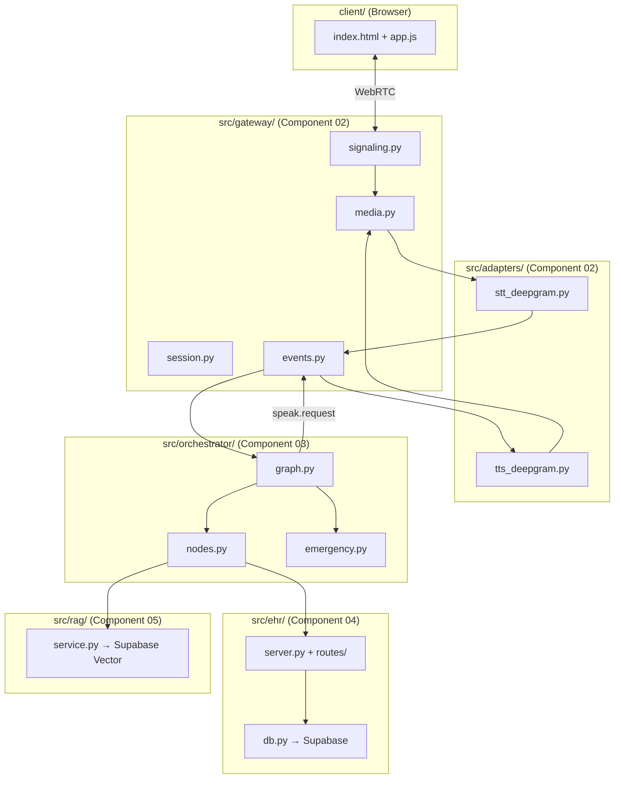

# MedCall AI — Source Code File Structure

## Goal

Define the application source code structure **before writing any code**. Every file maps directly to a component from the system design docs.

---

## Proposed Structure

```
Voice Agent/
│
├── PRD.md                              ← Single source of truth (exists)
├── requirements.txt                    ← Dependencies (updated ✅)
├── .env                                ← API keys & secrets (exists)
│
├── system design/                      ← Architecture docs (exists)
├── docs/                               ← Feature & schema docs (exists)
├── scripts/                            ← Data pipeline scripts (exists)
├── data/                               ← FHIR data & QA dataset (exists)
│
│── ── ── ── NEW APPLICATION CODE ── ── ── ── 
│
├── src/                                ← All application source code
│   ├── __init__.py
│   │
│   │── ── Component 02: Voice & Realtime Layer ── ──
│   │
│   ├── gateway/                        ← Realtime Gateway (WebRTC + signaling)
│   │   ├── __init__.py
│   │   ├── signaling.py                ← WebSocket signaling server (offer/answer/ICE)
│   │   ├── media.py                    ← Media bridge (aiortc PeerConnection, audio tracks)
│   │   ├── session.py                  ← Session manager (session_id ↔ WebRTC ↔ orchestrator)
│   │   └── events.py                   ← Event bus & event types (the contract from design doc)
│   │
│   ├── adapters/                       ← STT & TTS pluggable adapters
│   │   ├── __init__.py
│   │   ├── base.py                     ← Abstract base classes (STTAdapter, TTSAdapter)
│   │   ├── stt_deepgram.py             ← Deepgram streaming STT implementation
│   │   ├── tts_deepgram.py             ← Deepgram Aura streaming TTS implementation
│   │   ├── stt_mock.py                 ← Mock STT for local testing (no API key needed)
│   │   └── tts_mock.py                 ← Mock TTS for local testing (echo / silence)
│   │
│   │── ── Component 03: Conversation Orchestrator ── ──
│   │
│   ├── orchestrator/                   ← Conversation flow engine
│   │   ├── __init__.py
│   │   ├── graph.py                    ← Outer flow graph (state machine / node transitions)
│   │   ├── nodes.py                    ← Individual node definitions (IDENTIFY, SCHEDULE, etc.)
│   │   ├── emergency.py                ← Emergency gate (keyword + classifier)
│   │   ├── policies.py                 ← Tool allowlists per node, confirmation rules
│   │   └── state.py                    ← Session state model (current node, slots, patient_id)
│   │
│   │── ── Component 04: EHR Backend ── ──
│   │
│   ├── ehr/                            ← Mock EHR API (FastAPI)
│   │   ├── __init__.py
│   │   ├── server.py                   ← FastAPI app, route registration, startup
│   │   ├── routes/
│   │   │   ├── __init__.py
│   │   │   ├── patients.py             ← GET/POST /patients endpoints
│   │   │   ├── providers.py            ← GET /providers, availability
│   │   │   └── appointments.py         ← GET/POST/PATCH /appointments
│   │   ├── models.py                   ← Pydantic request/response schemas
│   │   └── db.py                       ← Supabase client wrapper
│   │
│   │── ── Component 05: RAG Service ── ──
│   │
│   ├── rag/                            ← Medical knowledge retrieval
│   │   ├── __init__.py
│   │   ├── service.py                  ← Embed query → Supabase Vector → return top-k
│   │   ├── embeddings.py               ← Embedding model setup
│   │   └── ingest.py                   ← Ingest approved policy KB files into Supabase Vector
│   │
│   │── ── Shared ── ──
│   │
│   ├── config.py                       ← Central config (loads .env, all settings)
│   └── logger.py                       ← Structured logging (non-PHI safe)
│
├── client/                             ← WebRTC browser client
│   ├── index.html                      ← Patient-facing web UI
│   ├── style.css                       ← Styling
│   └── app.js                          ← WebRTC PeerConnection, mic capture, UI logic
│
├── main.py                             ← Entry point: starts gateway + EHR server
│
└── tests/                              ← Test suite
    ├── __init__.py
    ├── test_signaling.py               ← WebRTC signaling round-trip
    ├── test_events.py                  ← Event bus contract
    ├── test_emergency.py               ← Emergency gate keyword detection
    └── test_session.py                 ← Session lifecycle
```

---

## How Each Folder Maps to the Design



---

## File-Level Responsibilities (Component 02 — what we build first)

### `src/gateway/`

| File | What it does | Key classes/functions |
|------|-------------|----------------------|
| **`signaling.py`** | FastAPI WebSocket endpoint. Handles SDP offer/answer exchange and ICE candidate relay between browser and server. | `SignalingServer`, `/ws/signaling` endpoint |
| **`media.py`** | Creates `aiortc.RTCPeerConnection`, receives audio track from client, feeds audio frames to STT adapter, plays TTS audio back to client. | `MediaBridge`, `AudioTrackSink`, `AudioTrackSource` |
| **`session.py`** | Creates/tracks/destroys sessions. Maps `session_id → {peer_connection, stt_adapter, tts_adapter, orchestrator_context}`. | `SessionManager`, `Session` dataclass |
| **`events.py`** | Typed event definitions + async event bus. The contract between gateway and orchestrator. | `Event` types, `EventBus` class |

### `src/adapters/`

| File | What it does |
|------|-------------|
| **`base.py`** | Abstract `STTAdapter` and `TTSAdapter` with `async` methods. Any provider can be swapped in. |
| **`stt_deepgram.py`** | Streams audio frames to Deepgram WebSocket → emits `transcript.partial` / `transcript.final` events |
| **`tts_deepgram.py`** | Sends text to Deepgram Aura → receives audio chunks → feeds to `AudioTrackSource` |
| **`stt_mock.py`** | Returns hardcoded transcripts on a timer (for testing without API key) |
| **`tts_mock.py`** | Returns silence or a pre-recorded audio file (for testing without API key) |

### `main.py`

```python
# Single entry point — runs everything
# Usage: python main.py

# Starts:
#   1. FastAPI app (signaling WebSocket + EHR REST API)
#   2. Serves client/ as static files
#   3. Open browser → connect → talk to agent
```

---

## Build Order (Phase 6 execution)

| Step | Files | What you can test |
|------|-------|-------------------|
| **1** | `config.py`, `logger.py`, `events.py` | Shared infra — import check |
| **2** | `signaling.py`, `media.py`, `session.py` | Browser ↔ server WebRTC audio round-trip |
| **3** | `base.py`, `stt_mock.py`, `tts_mock.py` | Audio flowing through mock adapters |
| **4** | `client/` (HTML + JS) | Full loop: speak → see transcript → hear echo |
| **5** | `stt_deepgram.py`, `tts_deepgram.py` | Real STT/TTS with Deepgram API key |
| **6** | `orchestrator/` | Conversation flow + emergency gate |
| **7** | `ehr/` | API endpoints + Supabase integration |
| **8** | `rag/` | Medical Q&A knowledge base |

---

## Open Questions

> [!IMPORTANT]
> **Package structure**: Should we use `src/` as the top-level package, or would you prefer a named package like `medcall/` instead of `src/`? (e.g., `from medcall.gateway import signaling`)

> [!IMPORTANT]
> **Entry point**: Single `main.py` that boots everything (gateway + EHR API on one FastAPI app), or separate processes for gateway and EHR server? Single process is simpler for v1.

> [!IMPORTANT]
> **Client**: Simple HTML/CSS/JS page served by FastAPI as static files, or do you want a more polished frontend later? For v1, a minimal working page with a "Connect" button + audio is sufficient.
