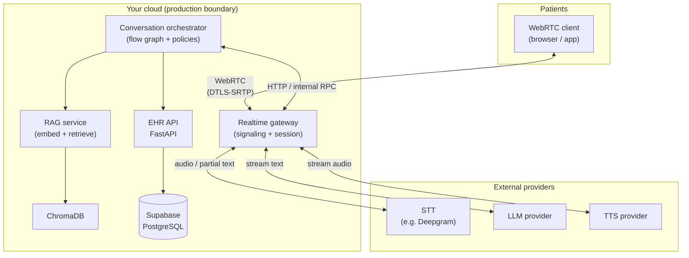
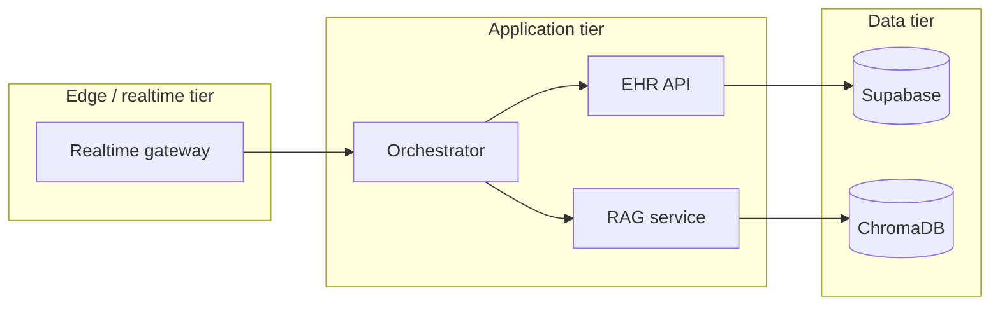
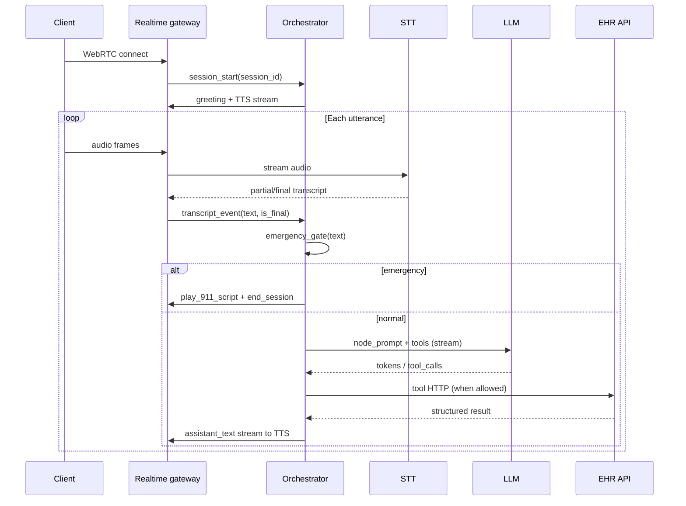

# Main system design

**Product:** Healthcare patient scheduler and intake voice agent (Mercy General).  
**Voice transport:** WebRTC.  
**Orchestration pattern:** Flow-based outer graph with **mandatory** emergency gating and confirmation steps; **LLM + tools** inside nodes for flexible dialogue.

This document is the **single top-level view** before drilling into per-component files.

---

## 1. Goals and non-goals

### Goals

- Natural voice intake: identify patient, route clinically, schedule, collect insurance/intake.
- **Emergency-first:** detect crisis language on every turn; interrupt and direct to 911 / ER.
- **Deterministic commitments:** booking, cancel, reschedule require explicit user confirmation and server-side validation.
- **Low latency:** streaming STT → LLM (streamed) → streaming TTS where possible.
- **Operable:** metrics, logs (non-sensitive), tracing, runbooks, human handoff.

### Non-goals (for this architecture baseline)

- Clinical diagnosis, prescribing, or definitive treatment advice (RAG and LLM are FAQ / routing only).
- Full PSTN telephony in v1 (WebRTC client is in scope; PSTN bridge can be a future adapter).

---

## 2. High-level context (C4-style)

Patients use a **WebRTC client**. A **realtime gateway** terminates signaling and coordinates media with STT/TTS and the **conversation orchestrator**. The orchestrator calls the **EHR API** (FastAPI) and **RAG service**; persistent state lives in **Supabase**. External providers supply STT, LLM, and TTS.

**Trust note:** The orchestrator is the **policy enforcement point** (emergency, confirmations, allowed tools). The LLM never bypasses it for side effects.

---

## 3. Logical component responsibilities

| Component | Responsibility |
|-----------|----------------|
| **WebRTC client** | Capture/play audio; establish secure session; minimal UX (connect, mute, disconnect, handoff). |
| **Realtime gateway** | WebRTC signaling; audio routing to STT; subscribe LLM/TTS streams; session heartbeat; backpressure. |
| **Conversation orchestrator** | Current graph node, transitions, slot-filling, tool allowlists per node, confirmation tokens, audit events. |
| **EHR API** | Patient lookup, profile summary, providers, availability, appointments; validates against DB and business rules. |
| **RAG service** | Embed query, retrieve top-k from Chroma, apply hospital scope filters, return citations/snippets to orchestrator. |
| **Supabase** | System of record for doctors, patients, profiles, appointments (per PRD schema). |
| **ChromaDB** | Vector store over curated healthcare Q&A (no raw PHI requirement in MVP dataset). |

---

## 4. Deployment view (reference)

Exact vendor (AWS/GCP/Azure) is flexible; the **logical** production layout should separate **edge/realtime** from **stateless APIs** and **data stores**.

**Production habits:** TLS everywhere; private connectivity to DB where available; secrets in a managed store; separate staging with anonymized data.

---

## 5. Call lifecycle (happy path, simplified)

---

## 6. Data and control planes

- **Control plane:** orchestrator state (current node, confirmed patient id, pending slot), policy checks, audit log entries.
- **Data plane:** audio streams, STT text stream, LLM token stream, TTS audio stream, EHR JSON payloads.

Keeping them separate avoids “accidentally” committing an appointment without passing through the orchestrator’s confirmation step.

---

## 7. Trust and customer-facing assurance (design-level)

Design so stakeholders can answer:

1. **What happens in an emergency?** One code path: gate runs first; scripted response; session end; event logged.
2. **When can an appointment be created?** Only after **explicit confirmation** and **server-side** `POST` with idempotency key; orchestrator never trusts raw model text as proof.
3. **Where does PHI live?** In Supabase and EHR API responses; **not** in long-lived client logs; LLM prompts use **minimized** clinical summary (see `05-component-data-rag.md`).
4. **What if the AI is wrong?** Human handoff path and safe defaults (“I’ll connect you with the front desk”) without inventing clinical facts.

Detailed security and operations: [`06-trust-security-operations.md`](06-trust-security-operations.md).

---

## 8. Related component documents

- Voice and realtime: [`02-component-voice-realtime.md`](02-component-voice-realtime.md)
- Orchestration: [`03-component-orchestration.md`](03-component-orchestration.md)
- Backend EHR: [`04-component-backend-ehr.md`](04-component-backend-ehr.md)
- Data and RAG: [`05-component-data-rag.md`](05-component-data-rag.md)
