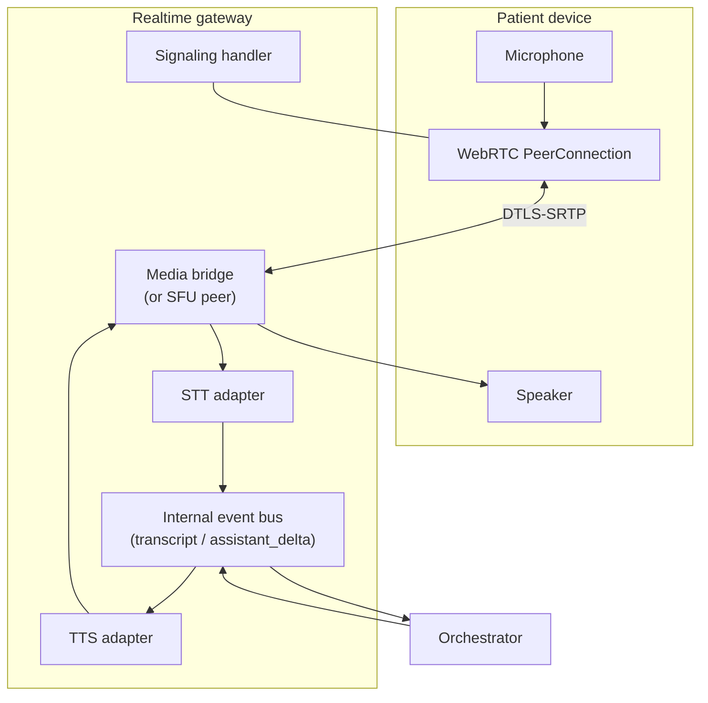
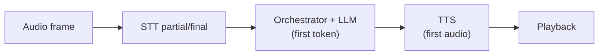

# Component design: voice and realtime layer (WebRTC)

This component delivers **low-latency, bidirectional audio** between the patient and the agent stack. It is the **sensory interface**; it does **not** own business rules (those live in the orchestrator).

---

## 1. Responsibilities

| Area | Responsibility |
|------|----------------|
| **Signaling** | Offer/answer, ICE, session teardown, reconnect policy. |
| **Media** | Opus (typical) over SRTP; echo cancellation on client; jitter buffers. |
| **Streaming STT** | Forward audio to STT; receive partial and final transcripts quickly. |
| **Streaming TTS** | Accept text chunks; synthesize with minimal buffering; align with barge-in policy. |
| **Session binding** | Map WebRTC session ↔ `session_id` ↔ orchestrator context. |

---

## 2. Reference topology

**Implementation note:** The “media bridge” might be your process forwarding RTP to a cloud STT API, or an SFU if you scale multi-party; for **1:1 patient–agent**, a controlled gateway process is enough for v1.

---

## 3. Event contract (gateway ↔ orchestrator)

Stable, versioned messages reduce production bugs.

| Event | Direction | Payload (conceptual) |
|-------|-----------|----------------------|
| `session.started` | G → O | `session_id`, client metadata |
| `transcript.partial` | G → O | `text`, `ts`, `confidence?` |
| `transcript.final` | G → O | `text`, `ts`, `utterance_id` |
| `barge_in.detected` | G → O | `reason` (user started speaking) |
| `speak.request` | O → G | `text` or `ssml?`, `mode=stream` |
| `speak.cancel` | O → G | stop TTS playback immediately |
| `session.end` | O → G | `reason` (completed, emergency, error, handoff) |

The orchestrator runs **emergency_gate** on **`transcript.final`** at minimum; optionally on high-confidence partials if latency tradeoffs are acceptable (see risks).

---

## 4. Latency budget (planning targets)

Voice feels sluggish when gaps exceed **~300 ms** perceptually; design for **streaming**, not round-trips per sentence.

| Stage | Target (order of magnitude) | Mitigation |
|-------|-----------------------------|------------|
| STT | ~150–300 ms to useful text | Streaming API; region proximity |
| Policy + LLM | first token ~200–500 ms | Small node prompts; tool-only turns |
| TTS | first audio ~150–300 ms | Streamed synthesis; cache common phrases |
| **End-to-end** | **minimize silence** | Overlap stages; barge-in; pre-roll greetings |

---

## 5. Barge-in (interruptions)

When the user talks over the agent:

1. Gateway detects active speech during TTS (client-side VAD and/or server hint).
2. Gateway sends `speak.cancel` to TTS and `barge_in.detected` to orchestrator.
3. Orchestrator **abandons** the current assistant turn’s pending tool calls unless already committed; resumes listening.

This is required for natural dialogue and prevents the user feeling “trapped” listening to a wrong prompt—important for **trust**.

---

## 6. Failure modes and safe behavior

| Failure | User-visible behavior | System behavior |
|---------|----------------------|-----------------|
| STT outage | “I’m having trouble hearing you.” | Retry; offer text fallback if product allows; handoff. |
| LLM timeout | Short apology; simplify prompt | Circuit breaker; fall back to scripted triage / handoff. |
| TTS outage | Play cached clip or handoff | Do not block emergency path—911 script should be **cached audio** if possible. |
| WebRTC disconnect | Clear reconnect or callback instruction | Persist session state briefly for reconnect (privacy permitting). |

---

## 7. Production checklist (voice layer)

- [ ] TLS for all non-WebRTC HTTP; SRTP for media.
- [ ] Rate limits on session creation; abuse detection.
- [ ] Metrics: time-to-first-text, time-to-first-audio, interrupt rate, STT error rate.
- [ ] Load test with bursty audio and packet loss simulation.

Next: how dialogue is controlled—[`03-component-orchestration.md`](03-component-orchestration.md).
