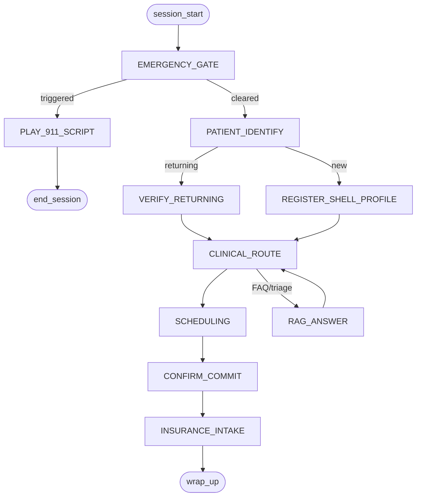
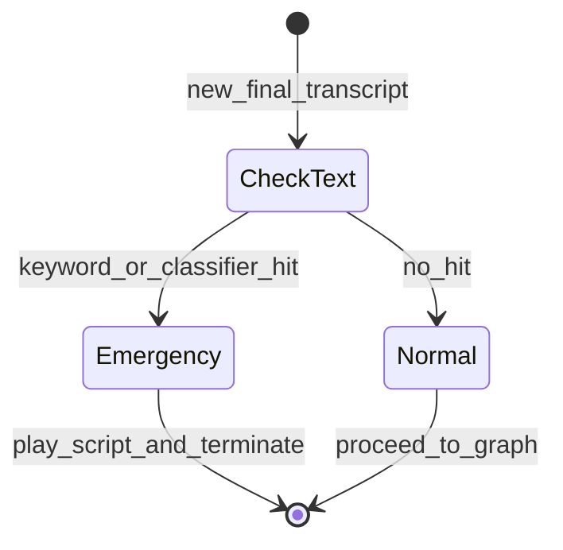
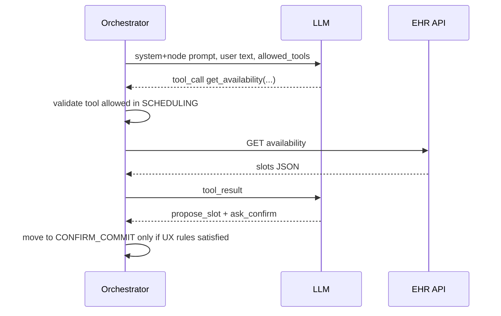
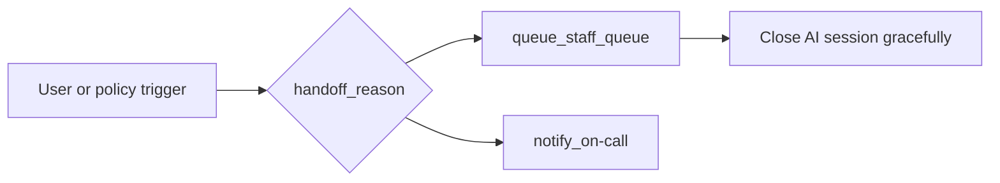

# Component design: conversation orchestration

The orchestrator is the **brain stem** of the system: it enforces **policy**, **order of operations**, and **what tools may run**. The LLM provides language understanding and suggested actions **inside** nodes—not global unconstrained control.

**Pattern:** Flow / node graph (outer) + tool-calling LLM (inner).  
**Non-negotiable:** Emergency gate on every finalized utterance (and optionally high-confidence partials).

---

## 1. Why this split builds trust

| Risk if LLM is fully in charge | Mitigation with orchestrator graph |
|--------------------------------|-----------------------------------|
| Skips identity verification | Graph requires `VERIFY_PATIENT` completion before `SCHEDULE`. |
| Books without confirmation | `COMMIT_BOOKING` node requires explicit `confirmed=true` token. |
| Ignores emergency wording | `EMERGENCY_GATE` runs **before** graph transition on new user text. |
| Hallucinates availability | Tools read **EHR API**; model only proposes; server validates. |

---

## 2. Outer graph (simplified)

**Note:** `RAG_ANSWER` is a **spoke** that returns to routing; it must still respect “no diagnosis / no promises” content rules.

---

## 3. Emergency gate (explicit FSM)

Treat emergency detection as a **small hard gate**, not a “soft LLM judgment” alone.

**Implementation guidance:**

- **Keyword layer:** fast, deterministic (PRD list + synonyms).
- **Classifier layer (optional):** LLM or small model **only** returns `emergency_score` with low latency; if uncertain, **bias toward emergency** when severe symptom lexicon overlaps (product/legal review).
- **Audit:** log `emergency_triggered` with **reason class**, not full transcript in logs if policy forbids; transcript retention is a policy decision (see trust doc).

---

## 4. Inner loop inside a node (LLM + tools)

Example: `SCHEDULING` node.

**Rule:** `book_appointment` tool is **not** available in `SCHEDULING`—only `get_providers`, `get_availability`, etc. Commit tools appear **only** in `CONFIRM_COMMIT`.

---

## 5. Tool allowlists by node (example)

| Node | Allowed tool types (examples) |
|------|-------------------------------|
| `PATIENT_IDENTIFY` | `lookup_patient`, `create_shell_patient` (after fields complete) |
| `CLINICAL_ROUTE` | `get_department_policies`, `note_chief_complaint` |
| `SCHEDULING` | `search_providers`, `get_availability` |
| `CONFIRM_COMMIT` | `book_appointment`, `reschedule_appointment`, `cancel_appointment` |
| `RAG_ANSWER` | `retrieve_kb` (scoped) |

Exact names should match [`04-component-backend-ehr.md`](04-component-backend-ehr.md) API design.

---

## 6. Confirmation and idempotency (production)

For any mutating appointment action:

1. Orchestrator presents **one** canonical summary (time in local TZ, provider, location).
2. User must give **affirmative** phrase or DTMF-equivalent (voice-only: “yes, book it”).
3. Orchestrator issues `Idempotency-Key: <session_id>:<utterance_id>` to EHR API.
4. On retry, EHR returns the same result without double booking.

---

## 7. Human handoff

Triggers: repeated ASR failure, user request, out-of-scope clinical demand, suspicious abuse, EHR errors beyond retry budget.

---

## 8. State persistence

Persist **orchestrator state** (node, slots, patient id) in a **durable store** (Redis + TTL or DB table) keyed by `session_id` so gateway restarts do not corrupt scheduling.

Next: backend API surface—[`04-component-backend-ehr.md`](04-component-backend-ehr.md).
