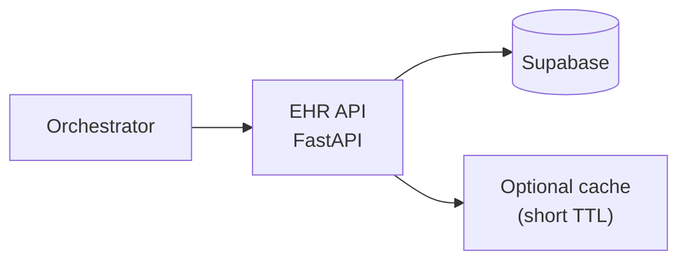
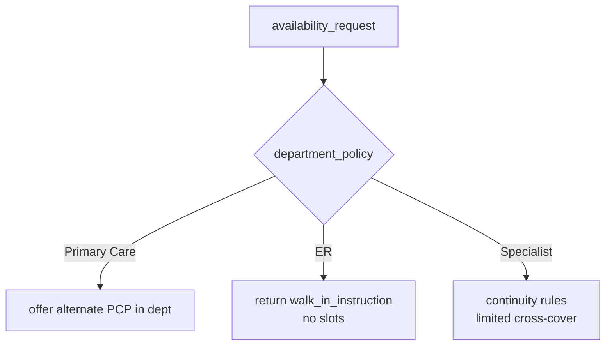

# Component design: backend EHR service (`ehr_server.py`)

The **EHR API** is the **system of record boundary** for patients, providers, and appointments. The orchestrator and LLM **must not** invent clinical or scheduling facts; they **request** them here.

**Stack:** FastAPI (per PRD). **Database:** Supabase / PostgreSQL.

---

## 1. Placement in the architecture

---

## 2. Design principles (production)

| Principle | Rationale |
|-----------|-----------|
| **Validate everything** | Specialty rules, referral flags, department booking constraints (e.g. ER walk-in). |
| **Idempotent writes** | Prevents double booking on AI/transport retries. |
| **Structured errors** | Orchestrator maps errors to safe user phrases + handoff. |
| **Audit fields** | `created_by`, `source=voice_agent`, timestamps on mutations. |
| **Least data in responses** | Return summaries orchestrator needs; avoid dumping raw FHIR to LLM. |

---

## 3. Endpoint map (aligned with PRD)

**Patient**

| Method | Path | Purpose |
|--------|------|---------|
| `GET` | `/patients/lookup` | By name + DOB + phone (return `patient_id` or 404). |
| `GET` | `/patients/{id}/profile` | Token-efficient clinical summary for LLM context. |
| `POST` | `/patients` | Create shell profile (new patient onboarding). |

**Providers & availability**

| Method | Path | Purpose |
|--------|------|---------|
| `GET` | `/providers` | Query by `name`, `specialty`, `department`. |
| `GET` | `/providers/availability` | Earliest slots by specialty / provider with cross-coverage rules applied server-side. |

**Appointments**

| Method | Path | Purpose |
|--------|------|---------|
| `POST` | `/appointments` | Book (requires idempotency key). |
| `PATCH` | `/appointments/{id}` | Reschedule. |
| `DELETE` or `POST` | `/appointments/{id}/cancel` | Cancel (pick one style; document). |

**Health**

| Method | Path | Purpose |
|--------|------|---------|
| `GET` | `/healthz` | Liveness. |
| `GET` | `/readyz` | DB + critical dependencies. |

Exact query parameters and JSON schemas should be frozen in an **OpenAPI** spec exported from FastAPI.

---

## 4. Cross-coverage and scheduling rules

Server-side enforcement (pseudocode policy):

The LLM **describes** options returned by API; it does **not** compute them.

---

## 5. Authentication (recommended evolution)

| Phase | Approach |
|-------|----------|
| **MVP / internal** | Service-to-service token (Bearer) from orchestrator; network isolation. |
| **Production** | mTLS or signed service JWT; rotate keys; per-environment secrets. |

Never expose EHR API publicly without **API gateway**, **auth**, and **rate limits**.

---

## 6. Error taxonomy (for safe UX)

| Code | Orchestrator behavior |
|------|----------------------|
| `404 patient` | Offer registration flow. |
| `409 conflict` / slot taken | Refresh availability; apologize once. |
| `422 validation` | Clarify one field; don’t loop more than N times → handoff. |
| `5xx` | Retry with backoff; then handoff. |

---

## 7. Observability

- **Tracing:** propagate `session_id`, `patient_id` (hashed if needed) on spans.
- **Metrics:** latency p95/p99 per route, error rate, idempotency replay count.
- **Logs:** structured JSON; **no** full PHI; redact phone/DOB or hash per retention policy.

Next: data layer and RAG—[`05-component-data-rag.md`](05-component-data-rag.md).
