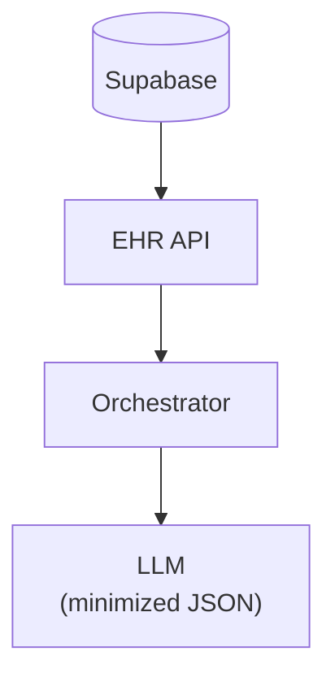
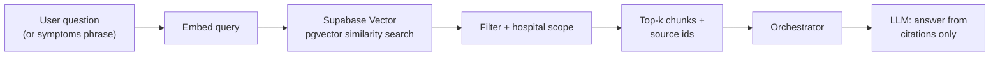

# Component design: data layer and RAG (Supabase + pgvector)

This document ties **persistent data** to **LLM context** and **knowledge retrieval**, with emphasis on **minimization** and **scope control**—both are essential for a production healthcare-adjacent voice product. The vector store is locked to **Supabase PostgreSQL with `pgvector`** so operational data and curated RAG knowledge share one managed platform.

---

## 1. Supabase logical model (from PRD)

```mermaid
erDiagram
  doctors ||--o{ appointments : has
  patients ||--o{ appointments : has
  patients ||--|| medical_profiles : has

  doctors {
    uuid id PK
    string specialty
    jsonb raw_fhir_data
  }

  patients {
    uuid id PK
    string phone
    date dob
  }

  medical_profiles {
    uuid patient_id PK_FK
    jsonb clinical_data
  }

  appointments {
    uuid id PK
    uuid patient_id FK
    uuid doctor_id FK
    timestamptz appointment_time
    string status
    string reason
  }
```

---

## 2. Read paths vs LLM context

| Use case | Data source | Notes |
|----------|-------------|-------|
| Authenticate | `patients` columns | Orchestrator compares normalized inputs. |
| Conversation context | `medical_profiles.clinical_data` | **Strip** billing noise (per PRD); cap list lengths; never send raw FHIR bundle to LLM. |
| Schedule | `doctors` + `appointments` | Availability computed in EHR API, not client-side. |



---

## 3. RAG pipeline

**Goal:** FAQ-level answers and triage **routing** language, not diagnosis.



### Ingestion (offline or batch)

1. Load curated RAG data files from `data/knowledge_base/`: `mercy_general_operational_policy.md`, `department_services.md`, `symptom_department_routing_guide.md`, and `faq_and_call_scripts.md`.
2. Normalize text; deduplicate; attach metadata: `{source_type, topic, department, allowed_claims, kb_version}`.
3. Embed with a fixed model version; store vectors in a Supabase `knowledge_chunks` table with a **kb version** tag.

### Retrieval constraints (production)

- **Citation-required answers:** model must only paraphrase retrieved text for clinical-adjacent topics.
- **Empty retrieval:** fall back to safe script: “I can’t assess symptoms; I can help you schedule or connect you to staff.”
- **Specialty scope:** if chunk metadata says “not offered here,” orchestrator blocks promising care.

---

## 4. Versioning and rollback

| Artifact | Versioning |
|----------|------------|
| Embedding model | Pin model id + dimension in config. |
| Supabase vector table | `knowledge_chunks` rows include `kb_version`; keep prior versions queryable for rollback. |
| `clinical_data` schema | Version field inside JSON; migrate with scripts. |

---

## 5. Privacy and retention (design intent)

- **Synthetic MVP data (Synthea):** still practice good hygiene—build pipelines as if PHI could appear later.
- **Retention:** define transcript retention default (e.g. 0 / 24h / 7d) per environment; document in ops doc.
- **Backups:** encrypted; access controlled; test restore quarterly.

Next: security, trust, and operations—[`06-trust-security-operations.md`](06-trust-security-operations.md).
