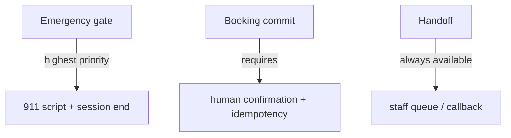

# Trust, security, and operations (production posture)

This document explains how the architecture **earns operator and patient trust**: predictable behavior under failure, clear boundaries on medical advice, and accountable auditing.

---

## 1. Threat and misuse model (baseline)

| Concern | Mitigation direction |
|---------|---------------------|
| **Session hijacking** | Strong session tokens; short-lived credentials; bind WebRTC to authenticated session where applicable. |
| **API abuse** | Rate limits, bot detection, anomaly alerts on booking endpoints. |
| **Prompt injection** | Orchestrator ignores LLM attempts to call disallowed tools; system prompts are not a security boundary—**allowlists** are. |
| **Data exfiltration via LLM** | Minimize context; block copy of raw records into user-visible channel if not required. |
| **Misleading medical claims** | RAG citations only + scripted refusals; no definitive diagnosis language. |

---

## 2. Safety-critical paths (must never regress)

**Release gates:** automated tests must cover emergency keywords, confirmation bypass attempts, and idempotent booking retries.

---

## 3. Audit and accountability

| Event | Fields (example) | Storage |
|-------|-------------------|---------|
| `session_started` | `session_id`, time, channel | append-only log store |
| `patient_verified` | `patient_id` hash, method | same |
| `availability_shown` | slot ids, not full PHI | same |
| `appointment_committed` | `appointment_id`, idempotency key | same + DB row |
| `emergency_triggered` | trigger class, time | same |
| `handoff` | reason code | same |

**Principle:** logs exist to **reconstruct decisions**, not to warehouse sensitive conversation content unless legally authorized and secured.

---

## 4. Encryption and secrets

- **In transit:** TLS 1.2+ everywhere for HTTP; WebRTC uses DTLS-SRTP.
- **At rest:** database encryption (Supabase-managed); secrets in KMS / vault.
- **Key rotation:** documented schedule; automated where possible.

---

## 5. SLOs (starter targets)

| SLO | Target | Measurement |
|-----|--------|-------------|
| EHR API availability | 99.9% monthly | synthetic probes |
| Voice “time to first agent audio” | p95 < X ms (set after baseline) | client beacon + server timestamps |
| Emergency script delivery | 100% when gate fires | synthetic + production monitors |
| Handoff success rate | track % completed vs abandoned | CRM/queue metrics |

Adjust **X** after profiling STT/LLM/TTS in your chosen regions.

---

## 6. Failure modes (customer-visible promises)

| Scenario | Promise |
|----------|---------|
| Degraded AI | User gets **clear status** and **human path**, not silence. |
| Partial outage (STT only) | Offer handoff; do not pretend understanding. |
| Database read-only | Read-only mode banner internally; block commits with safe messaging. |

---

## 7. Operational runbooks (outline)

1. **Incident: spike in 5xx on EHR** — scale pods, fail over read replica, enable cached read-only responses for non-commit tools only.
2. **Incident: STT provider down** — switch to backup region/provider if contract allows; else handoff mode.
3. **Incident: false emergency positives** — tune keyword list; review classifier threshold; **never** remove emergency path silently.

---

## 8. What you can tell customers (accurate positioning)

- The system is designed for **scheduling and intake**, with **explicit confirmations** for actions that change the calendar.
- **Emergencies** trigger a **fixed** escalation message; the AI does not “negotiate” in those moments.
- **Clinical questions** are handled with **curated knowledge** and **scope limits**; definitive medical decisions belong to licensed professionals.

This aligns engineering behavior with what marketing and compliance can defend.

---

## Document index

Return to [`README.md`](README.md) or main overview [`01-main-system-design.md`](01-main-system-design.md).
